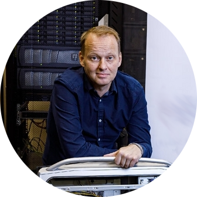
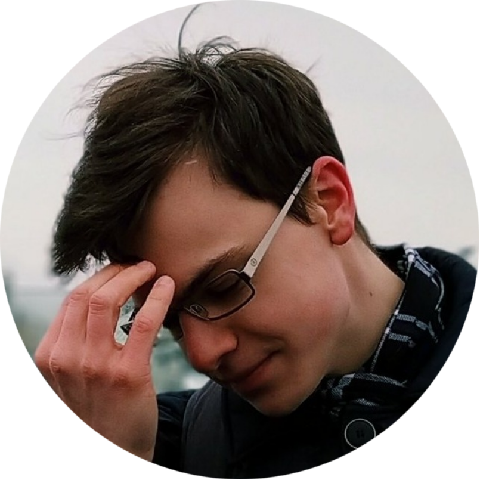

# **Cтуденческий практикум МГТУ им. Н.Э.Баумана по обработке графов в вычислительном комплексе Тераграф** 

**Московский государственный технический университет им. Н.Э.Баумана, 31 октября - 4 декабря 2022**

---

**Руководители практикума**

|    |    |    |
|: --------------------------------------- :|: --------------------------------------- :|: --------------------------------------- :|
|   [Алексей Попов](mailto:alexpopov@bmstu.ru),   *МГТУ им. Н.Э.Баумана*   |   [Станислав  Ибрагимов](mailto:ibragimov@bmstu.ru)     *МГТУ им. Н.Э.Баумана*    |   [Егор Дубровин](mailto:dubrovin.en@ya.ru)     *МГТУ им. Н.Э.Баумана*    |
 

---
	

# *Аннотация* 

> Всем участникам предоставляется доступ к вычислительному комплексу Тераграф для реализации проекта обработки и визуализации графов. 

В ходе практикума студенты знакомяться с различными аспектами представления информации в виде графов, их обработкой и визуализацией. Приводится структура вычислительного комплекса Тераграф, микропроцессора Леонард Эйлер и структура гетерогенного ядра обработки графов, а также особенности их программирования. Приводятся примеры инициализации графов в памяти ядра обработки графов, алгоритмов обработки и создания структур для визуализации. 

На основе изложенных сведений необходимо разработать распределенное приложение обработки и визуализации графов, функционирующее в системе Тераграф.

Практикум состоит из трех этапов:

- **Исследование микропроцессора Леонард Эйлер**

- **Практикум по программированию гетерогенного вычислительного узла**

- **Командная разработка алгоритмов обработки и визуализации графов**

[Вступительная презентация](https://github.com/alexbmstu/2021/blob/master/docs/%D0%9F%D1%80%D0%B0%D0%BA%D1%82%D0%B8%D0%BA%D1%83%D0%BC.pdf)

