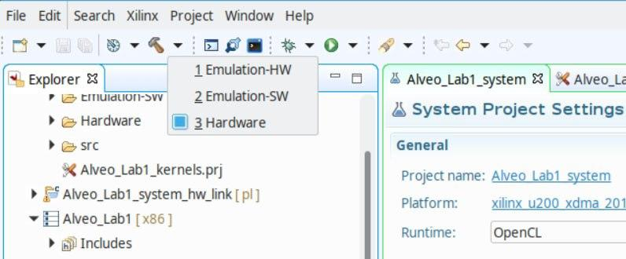
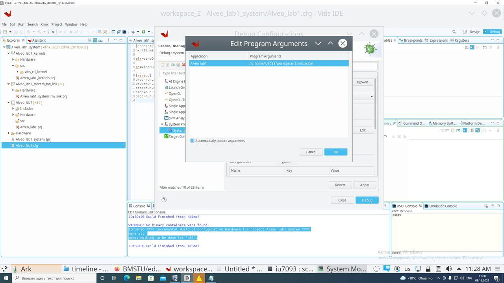
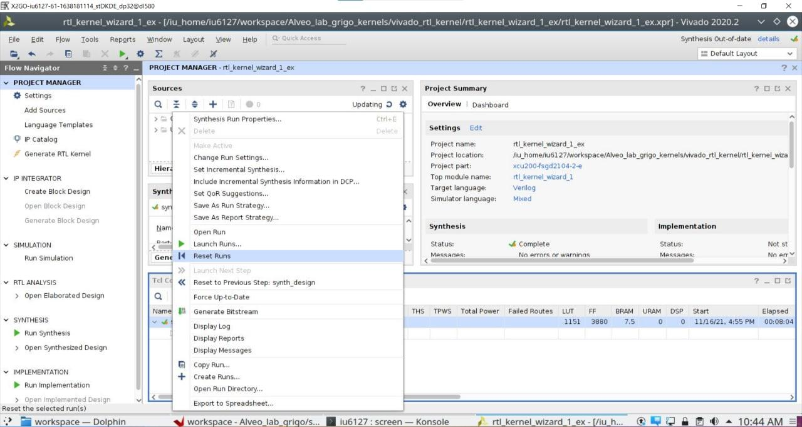
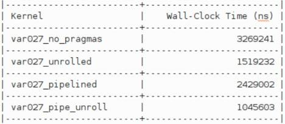

****
# Перспективы применения графов в задачах аналитики данных и искусственном интеллекте <a name="1"></a>


## Перспективы применения графов в задачах аналитики данных и искусственном интеллекте <a name="1_1"></a>

> Граф – множество вершин *X*, на элементах которого определены двуместные отношения смежности (ребра) – *(x<sub>j</sub>, x<sub>i</sub>) <em>&isin;</em>F* , где *x<sub>j</sub>*,*x<sub>i</sub> <em>&isin;</em> X*. Тогда пара вершин, находящихся в отношении смежности, рассматривается как ребро *u<sub>k</sub> = (x<sub>j</sub>, x<sub>i</sub>), u<sub>k</sub> <em>&isin;</em> U*.

На элементах множеств X и U определены также отношения **смежности** *F<sub>1</sub>(X,X)* и *F<sub>2</sub>(U,U)*. Например, вершине *x<sub>i</sub>* смежна вершина *x<sub>k</sub>*, если существует ребро *u<sub>j</sub>*, инцидентное *x<sub>i</sub>*, такое, что *x<sub>k</sub>* инцидентно ему. Аналогично ребру *u<sub>j</sub>* смежно ребро *u<sub>l</sub>*,если существует вершина *x<sub>i</sub>*, инцидентная ребру *u<sub>j</sub>*, такая, что *u<sub>l/<sub>* инцидентна этой вершине.

Существует несколько видов графов, отличающихся свойствами предикатов инцидентности – неориентированные, ориентированные, гипер- и ультраграфы, метаграфы. 


  
**Рисунок 1 — Виды графов**


Технологии представления и обработки знаний в виде графов приобрели большое значение во многих областях, в которых другие методы показали низкую эффективность. Благодаря способности сохранять информацию о различных объектах и явлениях и учитывать связи между ними, графы знаний могут использоваться при анализе больших данных в биоинформатике [1], в персонифицированной медицине, системах безопасности городов [2-6], в компьютерных сетях [7], финансовом секторе, при контроле сложного промышленного производства, для анализа информации социальных сетей и во многих других областях.  


Существенное влияние на эффективность применения аппаратных средств в задачах обработки графов оказывает адекватность их применения в рамках парадигмы рассматриваемой вычислений. Так, ряд задач обработки графов основан на статических графах, изменение которых либо не предусматривается вообще, либо происходит за пределами графового вычислителя. Для такого класса задач обработки графов характерным является этап передачи графа из исходного места хранения в оперативное хранилище графового вычислителя или же потоковая обработка. Подобная обработка  позволяет применять классические варианты построения вычислительных систем, в которых передача данных происходит большими или непрерывными пакетами, а останов ритмичной обработки не предусматривается спецификой алгоритмов. Для решения данного класса задач хорошо зарекомендовали себя графические ускорители GPU [17] и матрично-конвейерные структуры на ПЛИС [16]. 
Второй вариант постановки задач обработки графов отличается тем, что информация графа должна меняться как под воздействием внутренней обработки (например, результата поиска кратчайшего пути или центральных вершин), так и под воздействием внешних факторов (запросов на изменение информации графов). В этом случае граф должен находится непосредственно в оперативной памяти (памяти процессора общего назначения или специального устройства обработки графов). Такой вариант предполагает непрерывность процессов обработки и изменения, что приводит к необходимости применения иных архитектурных принципов.  Вычислительные средства, эффективно воплощающие подобную функциональность, опираются на оптимизацию алгоритмов доступа к структурам данных и графам в памяти, на повышение эффективности подсистемы памяти, на увеличение степени параллельность при обработке каждой нити вычислений. 

Приведенные выше различия статических и динамических задач обработки графов приводят к тому, что несмотря на большое количество и разнообразие средств вычислительной техники, потребность в высокопроизводительных ЭВМ для решения задач обработки графов знаний, чрезвычайно высока. При решении подобных задач дальнейшее увеличение скорости обработки на основе универсальных микропроцессорных систем трудно достижимо.  Даже благодаря высокому уровню параллелизма, глубокой конвейеризации и большим тактовым частотам современные микропроцессоры и графические ускорители не способны эффективно решать проблемы обработки больших графов. Сказываются такие фундаментальные проблемы, как: зависимости по данным [8,9]; необходимость распределения вычислительной нагрузки при обработке нерегулярных графов; наличия конфликтов при доступе к памяти большого количества обрабатывающих ядер [10]. 

Результаты исследований [10,11,13,14] показывают, что высокий уровень производительности современных многоядерных микропроцессоров и ускорителей GPU достигается за счет их высокого параллелизма и аппаратной сложности. При этом условный вклад в прирост производительности одного транзистора оказывается значительно ниже, чем у предыдущих моделей или меньшего количества параллельных микропроцессоров.

В настоящее время на рынке отсутствуют готовые программно-аппаратные комплексы для обработки графов сверхбольшой размерности, а исследователи и индустриальные потребители вынуждены самостоятельно создавать программные аналоги на основе открытых решений. В связи с этим в МГТУ им. Н.Э.Баумана было принято решение по созданию вычислительного комплекса, предназначенного для обработки графов и обладающего передовыми техническими характеристиками. Для это были проведены исследования и разработка специализированного программного обеспечения, архитектурных принципов работы вычислительных систем, а также  эффективных аппаратных средства обработки графовых структур. 


  


Ускорителями вычислений принято называть специальные аппаратные устройства, способные выполнять ограниченный ряд задач с большей параллельностью и за меньшее время в сравнении с универсальными микропроцессорными ЭВМ . Как правило, ускоритель представляет собой структуру, включающую большое количество примитивных микропроцессорных устройств, объединенных шинами связей. 

Топология связей и набор команд примитивных процессорных устройств определяется назначением ускорителя и позволяет высвободить место на кристалле для увеличения их количества. Таким образом достигается большая параллельность работы. Наибольшее преимущество дают так называемые потоковые ускорители, которые способны обрабатывать данные в темпе их поступления, и передавать по независимому интерфейсу далее, на последующую обработку.

В настоящее время применение ускорителей вычислений охватывает ряд важных областей: финансовые вычисления, ускорение запросов к базам данных, машинное обучение, видео-аналитика. В ряде случаев удается достичь ускорения более чем в 90 раз по сравнению с универсальными ЭВМ, построенными на микропроцессорах Intel x86.

  
**Рисунок 1 — Плата ускорителя Xilinx Alveo U200**

Создание ускорителей вычислений является трудоемким процессом, так как охватывает не только аппаратную разработку самого устройства, но и предполагает оптимизацию архитектуры ЭВМ для обеспечения наибольшей пропускной способности каналов передачи операндов и результатов, а также минимизации задержек и вычислительных затрат при ожидании работы ускорителей. Можно условно разделить ускорители на два класса: ускорители на основе СБИС и на основе ПЛИС. 

Первый класс имеет преимущества при крупносерийном выпуске, а значит может быть применим только для востребованных технологий, таких как GPGPU. Второй класс использует в качестве рабочей платформы современные крупноразмерные ПЛИС типа FPGA. Такой вариант имеет преимущества по оптимизации инфраструктуры устройства и системы, так как современные ПЛИС предполагают возможность репрограммирования. Однако, ПЛИС проигрывают СБИС по тактовым частотам и рассеиваемой мощности. 

В данной лабораторной работе мы изучим технологию создания ускорителей вычислений на основе ПЛИС. Основной плат ускорителя Xilinx Alveo U200 (рис. 1) является ПЛИС xcu200-fsgd2104-2-e архитектуры Xilinx UltraScale, выполненная по 16-нанометровой технологии. Плата обеспечивает взаимодействие с хост-системой через интерфейс PCIe gen3 x16, и помимо ПЛИС содержит 4 планки памяти DIMM DDR4 по 16 ГБ, и два QSFP разъема для подключения 100ГБ Ethernet сети. 

Для работы с ускорительной платой разработано специальное окружение XRT (Xilinx Runtime), включающее компоненты пользовательского пространства и драйвера ядра. XRT поддерживает как карты ускорителей на основе PCIe, так и встроенную архитектуру на основе MPSoC (для встраиваемых плат с ПЛИС Xilinx), обеспечивающую стандартизованный программный интерфейс для Xilinx FPGA. 

Благодаря этому достигается высокая унификация компонентов технологии и высокая степень переносимости кода ускорителей и ПО. XRT состоит из двух частей:

*   программного стека, работающего на базе ОС Linux в хост системе;
    
*   аппаратного модуля в `xrt` в виде софт ядра ПЛИС.
    
 

  
**Рисунок 2 — Программный стек XRT**

Основными компонентами, необходимыми для управления платой `Alveo U200` со стороны пользователя, являются:

*   утилита `xbutil`, позволяет выполнять загрузку пользовательского проекта на ПЛИС;
    
*   утилита `xbmgmt` служит для обновления версий XRT, сохраняемых в специальной EEPROM;
    
*   утилита `xclbinutil` предназначена для формирования конфигурационных образов для ПЛИС.
    

Программный стек содержит соответствующее стандарту OpenCL API для доступа к ускорителю. Это позволяет применять для разработки языки программирования Python/C/C++, и большое количество OpenCL-совместимых библиотек, таких как: Pytorch, Tensorflow, Caffe2 и многих других.

В оборудовании, используемом для проведения лабораторной работы, использована так называемая XDMA сборка XRT (существует также QDMA сборка, Amazon EC2 F1 сборка, Nimbix Cloud сборка), которая предполагает следующий сценарий взаимодействия ускорителя и пользовательского ПО:

1.  Пользовательское ПО сканирует и инициализирует доступные ускорительные платы, совместимые с XRT, определяет доступные ресурсы, создает программное окружение пользовательского аппаратного ядра ускорителя (далее используется термин kernel).
    
2.  Ресурсы локальной памяти ускорительной платы отображаются в пространство памяти хост системы.
    
3.  Инициализируются каналы DMA для прямого доступа к памяти ускорителя.
    
4.  Данные, подлежащие обработке, копируются из ОЗУ в локальную память ускорителя посредством DMA.
    
5.  Ядру ускорителя (или нескольким ядрам) посредством записи управляющих регистров, передаются параметры вычислений. Пользователь может увеличивать количество параметров по своему усмотрения. Типичным случаем является передача указателей на начало буферов исходных операндов и буфера результата, а также количество обрабатываемых значений.
    
6.  Хост-система выдает сигнал Start ядрам ускорителей, после чего начинается обработка внутри платы Xilinx Alveo.
    
7.  По завершении обработки kernel устанавливает флаг DONE, что вызывает прерывание по шине PCIe.
    
8.  Драйвер обрабатывает прерывание и сообщает пользовательскому ПО о завершении обработки.
    
9.  Пользовательское ПО инициализирует DMA передачу результатов из локальной памяти ускорителя в ОЗУ хост-системы.
    

Альтернативная сборка QDMA (Queue Direct Memory Access), доступная на картах ускорителей Alveo, предоставляет разработчикам прямое потоковое соединение с низкой задержкой между хостом и ядрами. Оболочка QDMA включает высокопроизводительный DMA, который использует несколько очередей, оптимизированных как для передачи данных с высокой пропускной способностью, так и для передачи данных с большим количеством пакетов. Только QDMA позволяет передавать поток данных непосредственно в логику FPGA параллельно с их обработкой. 

Оболочка XDMA требует, чтобы данные сначала были полностью перемещены из памяти хоста в память FPGA (DDRx4 DIMM или PLRAM), прежде чем логика FPGA сможет начать обработку данных, что влияет на задержку на запуска задачи.

  
**Рисунок 3 — Сравнение XDMA и QDMA сборок платформы XRT**

Потоковая передача напрямую в работающие ускорительные ядра (так называемый Free-Running-Mode) позволяет быстро и без излишней буферизации передавать операнды и результаты вычислений на хост по потоковому интерфейсу AXI4 Stream. Решение QDMA подходит для приложений, в которых вычисления строятся на передачи сравнительно небольших пакетов, но при этом требуется высокая производительность и минимальная задержка отклика.

  

## Описание архитектуры разрабатываемого ускорителя <a name="1_2"></a>

В ходе лабораторной работы будет использован базовый шаблон так называемого RTL проекта VINC, который может быть создан в IDE Xilinx Vitis и САПР Xilinx Vivado. Шаблон VINC выполняет попарное сложение чисел исходного массива и сохраняет результаты во втором массиве. Проект VINC включает:

*   Проект ПО хоста, выполняющий инициализацию аппаратного ядра и его тестирование через OpenCL вызовы.
    
*   Синтезируемый RTL проект ядра ускорителя на языках Verilog и SystemVerilog.
    
*   Функциональный тест ускорителя VINC на языке SystemVerilog.
    

Все перечисленные проекты создаются автоматически посредством запуска мастера RTL проектов в IDE Xilinx Vitis, и могут далее модифицироваться как через тот же мастер, так и в ручном режиме в САПР Xilinx Vivado, или обычном текстовом редакторе. Ряд проектных процедур необходимо запустить из консоли ОС Linux.

Проект VINC представляет собой аппаратное устройство, связанное шиной AXI4 MM (Memory mapped) с DDR[i] памятью, и получающее настроечные параметры по интерфейсу AXI4 Lite от программного обеспечения хоста (см. рисунок 4). В рамках всей системы используется единое 64-х разрядное адресное пространство, в котором формируются адреса на всех AXI4 шинах.

В каждой карте U200 имеется возможность подключить ускоритель к любому DDR[i] контроллеру в том регионе, где будет размещен проект. Всего для пользователя доступны 3 динамических региона: SLR0,1,2, для которых выделены каналы локальной памяти DDR[0], DDR[2], DDR[3] соответственно. Вся подключенная память DDR[0..3] доступна со стороны статического региона, в котором размещена аппаратная часть XRT. 

Память DDR[1] доступна для использования как в статическом регионе, так и в динамическом регионе SLR1. 

Предполагается, что эта память может служить для организации эффективной подсистемы памяти ускорительной карты: буферизации данных, передаваемых между хост-системой и ускорителем.

  

  
**Рисунок 4 — Размещение проекта на ПЛИС xcu200-fsgd2104-2-e карты Alveo U200**

  

Для организации прямого доступа к памяти DDR со стороны хоста также используется AXI4MM шина, соединяющая XDMA PCIe контроллер с контроллером памяти. Таким образом возможно реализовать ускоритель с типовой архитектурой XDMA, описанной ранее на рисунке 3.

Выбор одного из регионов для размещения проектов осуществляется на этапе так называемой линковки конфигурационного файла при помощи компилятора v++(фактически: компоновки, размещение и трассировки нескольких проектов в единый конфигурационный файл).

  

## Практическая часть <a name="1_3"></a>

  
### Подключение к серверу Alveo <a name="1_3_1"></a>

  

Для разработки проектов будет использован сервер с картой Alveo U200. На сервере установлены все необходимые средства разработки, и организован множественный доступ к рабочим столам пользователей.

Для доступа к серверу необходимо использовать клиент X2Go ([https://wiki.x2go.org/doku.php/doc:installation:x2goclient](https://wiki.x2go.org/doku.php/doc:installation:x2goclient)), который доступен для основных операционных систем: Windows, Linux, OsX, FreeBSD Unix.

Адрес сервера и параметры входа будут выданы преподавателем на лабораторной работе.

В окне программы X2Go создайте новое соединение с указанными параметрами.

Пароль необходимо сменить при первом входе:

  
  

Далее вы будете подключены к рабочему столу KDE операционной системы Ubuntu 18.04:

  

  
  

### Создание проекта VINC <a name="1_3_2"></a>

Запустите Vitis IDE.

  
  

Создайте новый проект в пункте: Create Application Project.

В открывшемся окне нажмите: Next.

  

  
  

  

В следующем окне выберите платформу xilinx\_u200\_xdma\_201830\_2.

  
  

Далее укажите название проекта

[comment]: <> (В следующем окне нажмите на кнопки: Vitis IDE Examples и Vitis IDE Libraries. В результате будут загружены примеры и демо-проекты, которые будут использованы в следующих лабораторных работах.)

Далее выберите пункт: Empty Application и Finish.

  

  

  
  

  

В итоге будет создан шаблон проекта, состоящий из следующих частей:

*   <Название проекта>\_kernels — исходные описания ядер проекта и результаты сборки объектных модулей \*.xo.
    
*   <Название проекта>\_system\_hw\_link — результаты линковки ядер в единый конфигурационный файл \*.xclbin
    
*   <Название проекта> - исходные описания программного обеспечения хоста.
    


  

Запустите мастер RTL проекта VINC. Для этого в меню Xilinx выберите пункт Launch RTL Kernel Wizard. Далее введите название вашего проекта и нажмите кнопку Next.

  

  
  

Далее укажите параметры:

*   `Number of Clocks` — 1
    
*   `Has Reset` — 0
    
*   `Kernel control interface` — `ap ctrl hs`
    

  

  
  

В следующем окне задайте имя настраиваемого параметра ядра.

Далее, в окне настройки AXI4 MM интерфейсов ядра введите название параметра — указателя на область памяти для размещения данных.

  

В следующем окне укажите количество потоковых интерфейсов: Number of AXI4-Stream Interfaces = 0.

  

  
  

В итоге будет создан проект ядра ускорителя и он будет открыт САПР Xilinx Vivado для редактирования.

  

  
  

Ознакомьтесь с содержимым модулей проекта. Большинство модулей написаны на языке SystemVerilog. Пояснения по синтаксису языка вы можете получить на странице: [http://www.asic-world.com/systemverilog/](http://www.asic-world.com/systemverilog/)

Модуль rtl\_kernel\_wizard\_0\_tb в разделе Simulation Sources содержит тест проекта.

Запустите симуляцию проекта в меню: Simulation → Run Simulation → Run Behavioural Simulation. Запустите тест и дождитесь конца симуляции (директива $finish).

  

  
  

Во вкладке Scope в модуле проекта inst\_dut вы можете выбрать и добавить в окно симуляции любые необходимые сигналы. При сохранении конфигурационного файла симуляции все сделанные вами изменения в списке сигналов будут учтены при следующем запуске симуляции.

  

По умолчанию, в диаграмму добавлены сигналы шины AXI4 MM, представляющие собой 5 независимых каналов передачи сообщений:

| Канал передачи                                    | Группы сигналов |
|---------------------------------------------------|-----------------|
| Канал чтения адреса от ведущего к ведомому        | m00\_axi\_ar\*  |
| Канал чтения данных от ведомого к ведущему        | m00\_axi\_r\*   |
| Канал записи адреса записи от ведущего к ведомому | m00\_axi\_aw\*  |
| Канал запись данных от ведущего к ведомому        | m00\_axi\_w\*   |
| Канал записи ответа от ведомого к ведущему        | m00\_axi\_b\*   |

  

Каналы позволяют сформировать конвейерные транзакции чтения и записи. Последовательность событий транзакции чтения можно представить следующим образом: ARVALID→ ARREADY→ RVALID→ RREADY.

Последовательность событий транзакции записи: AWVALID→ AWREADY → WVALID → WREADY → BVALID → BREADY.

  

Сформируйте следующие диаграммы:

*   Одна транзакция чтения данных вектора на шине AXI4 MM из DDR памяти (группы сигналов m00\_axi\_ar\* и m00\_axi\_r\*).
    
*   Одна транзакция записи результата инкремента данных на шине AXI4 MM (группы сигналов m00\_axi\_aw\*, m00\_axi\_w\* и m00\_axi\_b\*).
    
*     
    Инкремент данных в модуле <Название проекта>\_adder.v.
    

Результат занесите в отчет.

  

### Сборка проекта <a name="1_3_3"></a>

  

В САПР Xilinx Vivado выберите пункт Generate RTL Kernel. Далее выберите пункт Netlixt (DCP) based kernel (генерация ядра ускорителя в виде синтезированных низкоуровневых описаний).

  
  

В результате будет сформирован \*.xo файл, представляющий собой архив проекта Vivado с результатами синтеза. Путь к файлу \*xo вы может узнать в отчете по сборке или в TCL консоли Vivado.

Далее создайте конфигурационный файл <Название проекта>.cfg для запуска линковки проекта. В конфигурационом файле указывается основная информация для работы компилятора v++:

*   Количество и условные имена экземпляров ядер.
    
*   Тактовая частота работы ядра.
    
*   Для каждого ядра: выбор области SLR (SLR[0..2]), выбор DDR (DDR[0..3]) памяти, выбор высокопроизводительной памяти PLRAM( PLRAM[0,1,2]).
    
*   Параметры синтеза и оптимизации проекта.
    

Пример конфигурационного файла:

```
[connectivity]
 # Объявление ядра и экземпляров ядра (nk)
 # rtl_kernel_vinc   - Имя модуля верхнего уровня Vivado (см. RTL проект)
 # 2                 - Количество экземпляров ядра
 # vinc2,vinc1       - Условные имена экземпляров ядра (определяются разработчиком)
 # Доступ из ПО хоста выполняется по имени <Имя ядра>:{<Имя экземпляра>}. Например: rtl_kernel_vinc:{vinc0}
 nk=rtl_kernel_vinc:2:vinc0.vinc1

 # Связывание с регионом (slr)
 # vinc0             - Имя экземпляра ядра
 # SLR0              - Имя региона. Допустимые имена регионов: SLR0,SLR1,SLR2 
 slr=vinc0:SLR0

 # Связывание с интерфейсом памяти (sp)
 # vinc0             - Имя экземпляра ядра
 # axi4_0,axi4_1     - Имя интерфейса ядра в проекте Vivado (см. RTL проект). 
 # DDR[0],DDR[1]     - Имя интерфейса памяти. Допустимые имена интерфейса: PLRAM[0],PLRAM[1],PLRAM[2],DDR[0],DDR[1],DDR[2],DDR[3] 
 sp=vinc0.axi4_0:DDR[0]
 sp=vinc0.axi4_1:PLRAM[0]

 # Аналогичные директивы для каждого экземпляра ядра
 slr=vinc1:SLR1
 sp=vinc1.axi4_0:DDR[2]
 sp=vinc1.axi4_1:PLRAM[1]

[vivado]
 # Настройки параметров фазы имплементации
 prop=run.impl_1.STEPS.OPT_DESIGN.ARGS.DIRECTIVE=Explore
 prop=run.impl_1.STEPS.PLACE_DESIGN.ARGS.DIRECTIVE=Explore
 prop=run.impl_1.STEPS.PHYS_OPT_DESIGN.IS_ENABLED=true
 prop=run.impl_1.STEPS.PHYS_OPT_DESIGN.ARGS.DIRECTIVE=AggressiveExplore
 prop=run.impl_1.STEPS.ROUTE_DESIGN.ARGS.DIRECTIVE=Explore
```  

Конфигурационный файл занесите в отчет.

По умолчанию, если не задан конфигурационный файл, все интерфейсы будут подключены к одной и той-же внешней памяти.

В конфигурационном файле задайте описание для линковки одного ядра ускорителя VINC.

Далее в системной консоли или через ssh подключение к серверу запустите команду:

    screen

По команде будет создана независимая сессия консоли, что позволит отключиться от сервреа без останова процесса линковки.

Для выхода из сессии в основную консоль используйте команду Dettach (Ctrl+A,D).

Для повторного подключения к сессии используйте команду

    screen -r

  

Запустите линковку проекта в сессии screen:

    v++ -l -t hw -o <Путь к файлу vinc.xclbin>/vinc.xclbin -f xilinx_u200_xdma_201830_2 <Путь к *.xo> --config <Путь к конфигурационному файлу.cfg>

  

Процесс может занять до 6 часов. В результате будет сформирован файл \*.xclbin, который может быть передан в ускорительную карту утилитой xbutil. Однако, принято включать код для программирования ПЛИС непосредственно в код проекта Vitis. Вы можете обнаружить этот вызов в коде проекта:

  
```
 cl_int err;
 std::string binaryFile = (argc != 2) ? "vinc.xclbin" : argv[1]; //Путь к xclbin задается аргументом 
 unsigned fileBufSize;
 std::vector<cl::Device> devices = get_xilinx_devices();
 devices.resize(1);
 cl::Device device = devices[0]; //Выбираем первую найденную карту
 cl::Context context(device, NULL, NULL, NULL, &err);
 char *fileBuf = read_binary_file(binaryFile, fileBufSize); //Читаем xclbin в буфер
 cl::Program::Binaries bins{{fileBuf, fileBufSize}};
 cl::Program program(context, devices, bins, NULL, &err); //Программируем ПЛИС
```
  
Вместе с генерацией файла \*.xclbin, генерируется лог файл v++\*.log и файл описания ресурсов \*.xclbin.info. Ознакомьтесь с указанными файлами и занесите их содержимое в отчет.

  

### Запуск программного обеспечения на хост-системе <a name="1_3_4"></a>

  

Скопируйте автоматически созданный программный модуль host_example.cpp в проект <Название проекта>/src. Ознакомьтесь с его содержимым. 

Установите активную сборку Hardware. Для этого в Свойствах проекта установите активную сборку Hardware (пиктограмма "Молоток").




Выполните сборку проекта Project→Build.
  

  
  

В меню Xilinx войдите в пункт Debug Configuration.

Создайте новую Debug сессию типа System Project Debug.

Укажите в параметрах запуска путь  к файлу xclbin.

Уберите отметку в пункте Automatically update arguments! 




Нажмите кнопку Debug. После этого запустится сессия отладки, которая остановится в начале функции main().

Дальнейшая отладка выполняется стандартными процедурами: установка точек останова, создание списка просматриваемых переменных, просмотра дампа памяти и т.д.

> Если устройство занято другим проектом, вы можете сбросить его командой ```xbutil reset```!

> Если устройство не было разблокировано, это означает, что один из пользователей не остановил процесс отладки по ```dgb```. Вы можете остановить все отладчики в системе и сбросить карту командой ```sudo /opt/xilinx/overlaybins/reset.sh``` (даже несмотря на то, что вы не являетесь членом группы sudoers!!!)


### Индивидуальные задания <a name="1_3_5"></a>

1\.Измените код модуля <Название проекта>\_adder.v RTL таким образом, чтобы ускоритель выполнял указанную в Таблице 1 функцию.

**Таблица 1 — Индивидуальные варианты функций ускорителя**

| Вариант | Функция                                      | Регион           |
|---------|----------------------------------------------|------------------|
| 1       | R[i] = A[i]/2 + 10                           | SLR0,DDR[0]      |
| 2       | R[i] = A[i]\*16 + (10<<7)                    | SLR1,DDR[1]      |
| 3       | R[i] = (A[i] -1)\*4                          | SLR1,DDR[2]      |
| 4       | R[i] = max(A[i], 0xf0f0)                     | SLR2,DDR[3]      |
| 5       | R[i] = (A[i] + 3) / 2                        | SLR0,DDR[0]      |
| 6       | R[i] = A[i] & 0x76543210                     | SLR1,DDR[1]      |
| 7       | R[i] = A[i] & ~ 0xf                          | SLR1,DDR[2]      |
| 8       | R[i] = (A[i] + 10) & (255<<8)                | SLR2,DDR[3]      |
| 9       | R[i] = min (A[i] - 4, 5)                     | SLR0,DDR[0]      |
| 10      | R[i] = A[i]/8 + 14                           | SLR1,DDR[1]      |
| 11      | R[i] = 25 + A[i]/2                           | SLR1,DDR[2]      |
| 12      | R[i] = (A[i] & 0xf0f0f0f0f0) \+ 10           | SLR2,DDR[3]      |
| 13      | R[i] = A[i]\*8 + 10                          | SLR0,DDR[0]      |
| 14      | R[i] = A[i]/16 - 11                          | SLR1,DDR[1]      |
| 15      | R[i] = (A[i] + 128)/8                        | SLR1,DDR[2]      |
| 16      | R[i] = A[i]\*4 - 16                          | SLR2,DDR[3]      |
| 17      | R[i] = min(A[i] , 500) + 3                   | SLR0,DDR[0]      |
| 18      | R[i] = ~(A[i]+2)                             | SLR1,DDR[1]      |
| 19      | R[i] = max (A[i],3000)                       | SLR1,DDR[2]      |
| 20      | R[i] = min(A[i]-1,120)                       | SLR2,DDR[3]      |
| 21      | R[i] = ((~A[i])\*8)                          | SLR0,DDR[0]      |
| 22      | R[i] = ~A[i] + ~0xf                          | SLR1,DDR[1]      |
| 23      | R[i] = min(A[i]+3,1000)                      | SLR1,DDR[2]      |
| 24      | R[i] = (A[i] + 100) / 16                     | SLR2,DDR[3]      |
| 25      | R[i] = ~A[i] - (1024<<7)                     | SLR0,DDR[0]      |
| 26      | R[i] = min(A[i]-200,300)                     | SLR1,DDR[1]      |
| 27      | R[i] = max(A[i]\*128, 16)                    | SLR1,DDR[2]      |
| 28      | R[i] = (A[i] + 1024)\*32                     | SLR2,DDR[3]      |
| 29      | R[i] = (A[i] + 4)/1024                       | SLR0,DDR[0]      |
| 30      | R[i] = 2\*A[i] + 30                          | SLR1,DDR[1]      |

В САПР Xilinx Vivado заново соберите ядро. Для этого во вкладке Design Runs укажите правой кнопкой на конфигурации синтеза synth_1. Выберите пункт Reset Runs.

Удалите все *.xo файлы в проекте (в некоторых случаях было замечено, что xo файл не меняются):

``` find ~ -name \*.xo -delete ```

Далее в окне Flow Navigator выберите пункт Generate RTL Kernel, выберите пункт Netlixt (DCP) based kernel (генерация ядра ускорителя в виде синтезированных низкоуровневых описаний).




2\. Выполните моделирование ускорителя и зафиксируйте в отчете следующие диаграммы:

*   Транзакция чтения данных вектора на шине AXI4 MM из DDR памяти.
    
*   Транзакция записи результата инкремента данных на шине AXI4 MM.
    
*   Инкремент данных в модуле <Название проекта>\_adder.v.
    
3\. Выполните линковку ускорителя.

4\. Модифицируйте host\_example.cpp таким образом, чтобы выполнялась проверка выполнения вашей функции в ускорителе.

5\. Запустите программный тест. Результаты проверки работоспособности занесите в отчет.

  

## Содержание отчета <a name="1_4"></a>

1.  ФИО, номер группы студента, номер лабораторной работы.
    
2.  Функциональная схема разрабатываемой аппаратной системы (аналогично рисунку 4)
    
3.  Копии экранов моделирования исходного проекта VINC (транзакция чтения данных, транзакция записи результатов, инкремент данных в модуле <Название проекта>\_adder.v).
    
4.  Конфигурационный файл линковки.
    
5.  Содержимое файлов v++\*.log и \*.xclbin.info.
    
6.  Измененный код <Название проекта>\_adder.v в соответствии с индивидуальным заданием.
    
7.  Копии экранов модулирования измененного проекта VINC (транзакция чтения данных, транзакция записи результатов, инкремент данных в модуле <Название проекта>\_adder.v).
    
8.  Код модифицированного модуля host\_example.cpp.
    
9.  Результаты запуска host\_example.cpp (в виде листинга вывода на консоль или в виде таблицы с результатами теста).
    
## Контрольные вопросы <a name="1_5"></a>

  

1.  Назовите преимущества и недостатки XDMA и QDMA платформ.
    
2.  Назовите последовательность действий, необходимых для инициализации ускорителя со стороны хост-системы.
    
3.  Какова процедура запуска задания на исполнения в ускорительном ядре VINC.
    
4.  Опишите процесс линковки на основании содержимого файла v++\_\*.log.
    
## Ссылки на дополнительную литературу <a name="1_6"></a>


1.  [https://www.xilinx.com/products/design-tools/vitis/xrt.html](https://www.xilinx.com/products/design-tools/vitis/xrt.html)
    
2.  [https://www.xilinx.com/html_docs/xilinx2021_1/vitis_doc/index.html](https://www.xilinx.com/html_docs/xilinx2021_1/vitis_doc/index.html)
    
3.  [http://www.asic-world.com/systemverilog/](http://www.asic-world.com/systemverilog/)
    
4.  [https://www.xilinx.com/support/documentation/sw_manuals/xilinx2019_1/ug1238-sdx-rnil.pdf](https://www.xilinx.com/support/documentation/sw_manuals/xilinx2019_1/ug1238-sdx-rnil.pdf)
    

# Лабраторная работа №2. Разработка ускорителей вычислений средствами САПР высокоуровневого синтеза Xilinx Vitis HLS <a name="2"></a>

**Цель работы**

Изучение методики и технологии синтеза аппаратных устройств ускорения вычислений по описаниям на языках высокого уровня. В ходе лабораторной работы рассматривается маршрут проектирования устройств, представленных в виде синтаксических конструкций ЯВУ C/C++, изучаются принципы работы IDE Xilinx Vitis HLS и методика анализа и отладки устройств. В ходе работы необходимо разработать ускоритель вычислений по индивидуальному заданию, разработать код для тестирования ускорителя, реализовать ускоритель с помощью средств высоко-уровненного синтеза, выполнить его отладку.

## Методология ускорения вычислений на основе ПЛИС <a name="2_1"></a>


Ускорение вычислительных алгоритмов с использованием программируемых логических интегральных схем (ПЛИС) имеет ряд преимуществ по сравнению с их реализацией на универсальных микропроцессорах, или графических процессорах. В то время, как традиционная разработка программного обеспечения связана с программированием на заранее определенном наборе машинных команд, разработка программируемых устройств - это создание специализированной вычислительной структуры для реализации желаемой функциональности.

Микропроцессоры и графические процессоры имеют предопределенную архитектуру с фиксированным количеством ядер, набором инструкций, и жесткой архитектурой памяти, и обладают высокими тактовыми частотами и хорошо сбалансированной конвейерной структурой. Графические процессоры масштабируют производительность за счет большого количества ядер и использования параллелизма SIMD/SIMT (Рисунок 1). В отличие от них, программируемые устройства представляют собой полностью настраиваемую архитектуру, которую разработчик может использовать для размещения вычислительных блоков с требуемой функциональностью. В таком случает, высокий уровень производительности достигается за счет создания длинных конвейеров обработки данных, а не за счет увеличения количества вычислительных единиц. Понимание этих преимуществ является необходимым условием для разработки вычислительных устройств и достижения наилучшего уровня ускорения.

  

**Рисунок 1 — Принципы организации вычислений на различных платформах**

  
  

Методологию создания ускорителей на ПЛИС с применением средств синтеза высокого уровня (High Level Synthesis, HLS) можно представить в виде трех этапов:

1.  Создание архитектуры приложения.
    
2.  Разработка ядра аппаратного ускорителя на языках C/C++.
    
3.  Анализ производительности и выявление способов ее повышения.
    

На первом этапе разработчик принимает ключевые решения об архитектуре приложения, определяет функции, которые должны быть реализованы аппаратными ядрами устройств и программной частью решения, выбирает варианты конвейеризации обработки данных и способы их реализации.

На втором этапе разработчик реализует ядра ускорителей (kernels). Это, в первую очередь, включает в себя структурирование исходного кода и описание архитектуры ядер с помощью директив компилятора v++ (в большинстве случаев используются директивы #pragma).

Так как оптимизация производительности, это итеративный процесс, то может понадобится дальнейшее совершенствование первоначальной версии приложения: изменения количества и состава обрабатывающих блоков, топологии их связей, вариантов хранения и передачи промежуточных результатов вычислений. Таким образом, после получения работоспособного решения следует третий этап: анализ производительности полученного решения и изменение аспектов реализации.

В ходе лабораторной работы будет выполнен один проход по указанным трем этапам проектирования ускорителей.

## Разработка устройств ускорения на языке С/C++ <a name="2_2"></a>

В языках описания аппаратных средств, таких как VHDL, Verilog, SystemVerilog или SystemC используются базовые конструкции ЯВУ для описания поведенческой логики аппаратных устройств. Например, конструкции выбора одного из альтернативных вариантов (switch, if, ?) позволяют воплотить такие схемотехнические устройства, как: мультиплексоры, дешифраторы и шифраторы. Применение же циклов позволяет многократно воплощать в проекте однотипные схемные блоки и связать их в конвейерную структуру (аналогично тому, как это обычно происходит при программировании параллельных вычислительных систем). 

Логичным развитием способов описания схем является применение некоторого подмножества конструкций ЯВУ для описания аппаратных устройств. Это позволяет использовать различные подходы к ускорению вычислений на основе простых конструкций языков высокого уровня: условных операторов, арифметических выражений, циклов, вызовов функций и других. Например, на рисунке 2 показан пример конструкции для вычисления значения квадратичной функции `y=ax^2+bx+c`. 

При реализации в виде аппаратной схемы становится возможным не только построить параллельную структуру для вычисления одного значения функции, но многократно повторить это устройство для параллельного вычисления сразу нескольких значений (`y0=f(x0),y1=f(x1),y2=f(x2),...`).
  
```
void sq_func(int in[128], int a, int b, int c, int out[128]) {
     for(int i = 0; i < 128; i++) {
         out[i] = a*in[i]*in[i] + b*in[i] + c; 
     }
}
```


**Рисунок 2 — Пример оптимизации обработки потока данных в аппаратном ускорителе**

  
  

Компилятор Xilinx Vitis v++ является одним из наиболее удачных проектов в этой области, и позволяет генерировать из описаний на языке C/C++ синтезируемые низкоуровневые RTL проекты, которые затем отображаются на структуру ПЛИС. Этот подход дает возможность использовать один HLS компилятор как для генерации аппаратного кода, так и для генерации кода хост-системы. Разделение логики алгоритма на программную и аппаратную составляющие происходит автоматически в процессе компиляции аппаратно-программного объектного кода \*.xo (по аналогии с генерацией объектного кода \*.o компилятором g++).

Несмотря на то, что HLS компилятор v++ генерирует оптимизированные аппаратные архитектуры из кода ЯВУ C/C++, он не способен определить оптимальную архитектуру устройства. Даже если программное обеспечение может быть автоматически синтезировано в аппаратное обеспечение, для достижения приемлемого качества результатов требуется указание специальных параметров синтеза, топологии связей, настроек конвейеризации и т.д. Таким образом, разработчик должен иметь представление о том, как код ЯВУ преобразуется в схему устройства, чтобы эффективно влиять на конечный результат. 

Компилятор HLS имеет более строгие ограничения по сравнению со стандартными программными компиляторы (gcc, msvc и пр.). Например, такие конструкции как вызовы системных функций, динамическое выделение памяти и рекурсивные функции не могут быть использованы для генерации ядер.

В методологии HLS аппаратное ядро - это совокупность настраиваемых каналов передачи и связанная с ними сеть хранения данных. Эта сеть представляет собой иерархию памяти, которая выполняет функцию перемещения данных между хост-системой в ядром с максимальной эффективностью.

  
**Рисунок 3 — Процесс компиляции и линковки** **проекта [2].**


  

Процесс сборки ускорителя в Vitis IDE начинается с анализа исходного кода проекта и выделении кода аппаратных ядер и кода хост-системы (Рисунок 3). Код программной части хост-системы далее обрабатывается с использованием стандартного компилятора GNU C/C++ и транслируется в исполняемый бинарный файл. Код ядра ускорителя сначала компилируются в файл объекта Xilinx (.xo), а далее связываются с другими ускорительными ядрами для создания двоичного файла FPGA (.xclbin) и может быть передан в ПЛИС.

Другим полезным следствием применения С/С++ в качестве языков разработки аппаратных устройств является возможность программной симуляции устройства без каких-либо изменений или создания тестов. Действительно, благодаря компиляции кода с помощью обычного компилятора можно проверить функциональность хост-программы, а также измерить время ее работы. Для этих целей, компилятор Vitis может быть настроен на одну из трех целей сборки: программную эмуляцию, аппаратную эмуляцию и аппаратную сборку проекта (по умолчанию).

*   Программная эмуляция (Emulation-SW) - код ядра компилируется для работы на ЦПУ хост-системы. Этот вариант сборки служит для верификации совместного исполнения кода хост-системы и кода ядра, для выявления синтаксических ошибок, выполнения отладки на уровне исходного кода ядра, проверки поведения системы.
    

*  Аппаратная эмуляция (Emulation-HW) - код ядра компилируется в аппаратную модель (RTL), которая запускается в специальном симуляторе на ЦПУ. Этот вариант сборки и запуска занимает больше времени, но обеспечивает подробное и точное представление активности ядра. Данный вариант сборки полезен для тестирования функциональности ускорителя и получения начальных оценок производительности.
    
*  Аппаратное обеспечение (Hardware) - код ядра компилируется в аппаратную модель (RTL), а затем реализуется на FPGA. В результате формируется двоичный файл xclbin, который будет работать на реальной FPGA.
    

  
  

## Описание ядра ускорителя на языке C/C++ <a name="2_3"></a>

  

Для выделения в исходном коде функций, подлежащих аппаратному синтезу, необходимо описать для них так называемую «функцию ядра». Объявление этой функции должно быть заключено в оболочку <extern "C">. Допустимо использовать объявление как в заголовочном файле, так и в исходном коде модуля .c/.cpp:

```
extern "C" {
    void example(int *source_buf, int *result_buf, int count); //указатели на буферы и кол-во единиц данных
}
```

Из кода функции ядра видно, что представленный ускоритель должен получать настроечные параметры: указатели на области памяти исходных данных и результатов в памяти DDR[0..3] или так называемой PLRAM[0..2], а также количество обрабатываемых чисел. Исходные данные должны быть помещены в буфер \*source\_buf до запуска процесса вычислений, а результаты будут доступны после его окончания. Таким образом, необходимо также реализовать в ускорителе механизм управления вычислениями, который реализуется на основе дополнительного интерфейса AXI Lite и не показывается явно при описании функций ядра. Такой стандартный механизм управления реализуется в проекте RTL автоматически и настроек не требует.

Рассмотрим пример исходного кода функции ядра, выполняющей сложение двух чисел из массивов A\_buf и A\_buf, и записывающего результат в буфер R\_buf.

```
 extern "C" {
 void vadd(
 const unsigned int *A_buf, 	// Массив 1 (только чтение)
 const unsigned int *B_buf, 	// Массив 2 (только чтение)
 unsigned int *R_buf,         	// Массив результата (чтение и запись)
 int count                 		// Количество чисел
 )
 {
 #pragma HLS INTERFACE m_axi port= A_buf bundle=aximm1
 #pragma HLS INTERFACE m_axi port= B_buf bundle=aximm2
 #pragma HLS INTERFACE m_axi port= R_buf bundle=aximm1
  for(int i = 0; i < count; ++i)
  {
  R_buf[i] = A_buf[i] + B_buf[i];
  }
 }
}
```
Прагмы `<HLS INTERFACE ...>` используются для отображения параметров функции на отдельные порты ядра. По умолчанию компилятор Vitis сопоставляет эти три параметра с одним и тем же интерфейсом AXI4 (m\_axi), что приводит к использовании одной DDR памяти для хранения всех массивов. Большую производительность, но и аппаратную сложность, будет обеспечивать параллельный доступ к различным массивам памяти. Для этого было использовано ключевое слово <bundle=...>, которое определяет условное имя порта (имя определяется разработчиком). В результате, компилятор создаст отдельный порт для каждого уникального имени bundle, в результате чего будет скомпилирован \*.xo объект с двумя интерфейсами AXI4MM: aximm1 и aximm2.

Для взаимодействия с ускорителем можно использовать следующий пример кода хост-системы:

```cpp
 #define CL_HPP_CL_1_2_DEFAULT_BUILD
 #define CL_HPP_TARGET_OPENCL_VERSION 120
 #define CL_HPP_MINIMUM_OPENCL_VERSION 120
 #define CL_HPP_ENABLE_PROGRAM_CONSTRUCTION_FROM_ARRAY_COMPATIBILITY 1
 #define CL_USE_DEPRECATED_OPENCL_1_2_APIS

 #define INT_COUNT 4096

 #include <vector>
 #include <unistd.h>
 #include <iostream>
 #include <fstream>
 #include <CL/cl2.hpp>

// Объявление заголовков  сервисных вызовов
std::vector<cl::Device> get_xilinx_devices(); //Формирование списка доступных устройств
char *read_binary_file(const std::string &xclbin_file_name, unsigned &nb); //Чтение xclbin файла

// ------------------------------------------------------------------------------------
// Основная программа
// ------------------------------------------------------------------------------------
int main(int argc, char **argv)
{
 // ------------------------------------------------------------------------------------
 // Этап 1: Инициализация OpenCL окружения
 // ------------------------------------------------------------------------------------
 cl_int err;
 std::string binaryFile = (argc != 2) ? "vadd.xclbin" : argv[1]; //Путь к xclbin задается аргументом 
 unsigned fileBufSize;
 std::vector<cl::Device> devices = get_xilinx_devices();
 devices.resize(1);
 cl::Device device = devices[0]; //Выбираем первую найденную карту
 cl::Context context(device, NULL, NULL, NULL, &err);
 char *fileBuf = read_binary_file(binaryFile, fileBufSize); //Читаем xclbin в буфер
 cl::Program::Binaries bins{{fileBuf, fileBufSize}};
 cl::Program program(context, devices, bins, NULL, &err); //Программируем ПЛИС
 cl::CommandQueue q(context, device, CL_QUEUE_PROFILING_ENABLE, &err); //Создаем очередь команд
 cl::Kernel krnl_vector_add(program, "vadd", &err); //Создаем экземпляр сервисного Kernel объекта для «vadd»

 // ------------------------------------------------------------------------------------
 // Этап 2: Создаем буферы и отображаем их на устройство
 // ------------------------------------------------------------------------------------
 // Выделяем память под буферы в ОЗУ
 cl::Buffer A_buf(context, CL_MEM_READ_ONLY, sizeof(int) * INT_COUNT, NULL, &err);
 cl::Buffer B_buf(context, CL_MEM_READ_ONLY, sizeof(int) * INT_COUNT, NULL, &err);
 cl::Buffer R_buf(context, CL_MEM_WRITE_ONLY, sizeof(int) * INT_COUNT, NULL, &err);

 // Отображаем буферы на параметры функции ядра
 krnl_vector_add.setArg(0, A_buf);
 krnl_vector_add.setArg(1, B_buf);
 krnl_vector_add.setArg(2, R_buf);

 // Отображаем буферы на память устройства для организации прямого доступа к памяти
 int *A = (int *)q.enqueueMapBuffer(A_buf, CL_TRUE, CL_MAP_WRITE, 0, sizeof(int) * INT_COUNT);
 int *B = (int *)q.enqueueMapBuffer(B_buf, CL_TRUE, CL_MAP_WRITE, 0, sizeof(int) * INT_COUNT);
 int *R = (int *)q.enqueueMapBuffer(R_buf, CL_TRUE, CL_MAP_WRITE | CL_MAP_READ, 0, sizeof(int) * INT_COUNT);

 // Готовим массивы данных для теста 
 for (int i = 0; i < INT_COUNT; i++)
 {
 A[i] = rand() % INT_COUNT;
 B[i] = rand() % INT_COUNT;
 R[i] = 0;
 }

 // ------------------------------------------------------------------------------------
 // Этап 3: Запускаем задачу в ядре
 // ------------------------------------------------------------------------------------
 // Устанавливаем необходимые нам значения 
 krnl_vector_add.setArg(0, A_buf);
 krnl_vector_add.setArg(1, B_buf);
 krnl_vector_add.setArg(2, R_buf);
 krnl_vector_add.setArg(3, INT_COUNT);

 // Копируем содержимое буферов в DDR память ускорительной карты
 q.enqueueMigrateMemObjects({A_buf, B_buf}, 0 /* 0 means from host*/);
 // Запускаем задачу на исполнение и ждем готовности по прерыванию
 q.enqueueTask(krnl_vector_add);
 // Читаем обратно данные из DDR памяти устройства в буфер результатов
 q.enqueueMigrateMemObjects({R_buf}, CL_MIGRATE_MEM_OBJECT_HOST);

 // По готовности устройства закрываем очередь команд
 q.finish();

 // ------------------------------------------------------------------------------------
 // Этап 4: Проверка результатов обработки и освобождение памяти
 // ------------------------------------------------------------------------------------
 bool match = true;
 for (int i = 0; i < INT_COUNT; i++)
 {
 int expected = A[i] + B[i];
 if (R[i] != expected)
 {
 std::cout << "Error: Result mismatch" << std::endl;
 std::cout << "i = " << i << " CPU result = " << expected << " Device result = " << R[i] << std::endl;
 match = false;
 break;
 }
 }

 delete[] fileBuf;

 std::cout << "TEST " << (match ? "PASSED" : "FAILED") << std::endl;
 return (match ? EXIT_SUCCESS : EXIT_FAILURE);
}

// ------------------------------------------------------------------------------------
// Сервисные функции
// ------------------------------------------------------------------------------------
std::vector<cl::Device> get_xilinx_devices()
{
 size_t i;
 cl_int err;
 std::vector<cl::Platform> platforms;
 err = cl::Platform::get(&platforms);
 cl::Platform platform;
 for (i = 0; i < platforms.size(); i++)
 {
 platform = platforms[i];
 std::string platformName = platform.getInfo<CL_PLATFORM_NAME>(&err);
 if (platformName == "Xilinx")
 {
 std::cout << "INFO: Found Xilinx Platform" << std::endl;
 break;
 }
 }
 if (i == platforms.size())
 {
 std::cout << "ERROR: Failed to find Xilinx platform" << std::endl;
 exit(EXIT_FAILURE);
 }

 //Получаем список устройств и выбираем первый найденный
 std::vector<cl::Device> devices;
 err = platform.getDevices(CL_DEVICE_TYPE_ACCELERATOR, &devices);
 return devices;
}

char *read_binary_file(const std::string &xclbin_file_name, unsigned &nb)
{
 if (access(xclbin_file_name.c_str(), R_OK) != 0)
    {
        printf("ERROR: %s xclbin not available please build\n", xclbin_file_name.c_str());
        exit(EXIT_FAILURE);
    }
 //Загружаем содержимое xclbin в буфер и терминируем его
    std::cout << "INFO: Loading '" << xclbin_file_name << "'\n";
    std::ifstream bin_file(xclbin_file_name.c_str(), std::ifstream::binary);
    bin_file.seekg(0, bin_file.end);
 nb = bin_file.tellg();
 bin_file.seekg(0, bin_file.beg);
 char *buf = new char[nb];
 bin_file.read(buf, nb);
 return buf;
}
```

Исходный код примера состоит из следующих этапов:

**Этап 1:** Инициализируется среда OpenCL. На этом этапе хост должен инициировать доступ к подключенному устройство Xilinx, и загрузить в него двоичный файл .xclbin. Затем создается очередь команд и объект ядра.

Для настройки среды OpenCL выполняются следующие вызовы API:

_**clGetPlatformIDs**_ запрашивает у системы любые доступные платформы OpenCL. Он вызывается дважды, так как сначала извлекает количество платформ и далее, для извлечения фактически поддерживаемых платформ.

_**ClGetPlatformInfo**_ получает конкретную информацию о платформе OpenCL, такую как название вендора и название платформы.

_**ClGetDeviceIDs**_ получает список устройств, доступных на платформе.

_**clCreateContext**_ создает контекст OpenCL, который управляет объектами среды выполнения.

_**ClGetDeviceInfo**_ получает информацию об устройстве OpenCL, например имя устройства.

_**ClCreateProgramWithBinary**_ создает программный объект для контекста и загружает указанные двоичные данные в программный объект. Фактическая программа получается перед этим вызовом через функцию load\_file\_to\_memory ()

_**clCreateKernel**_ создает объект ядра

_**clCreateCommandQueue**_ создает очередь команд на определенном устройстве

**Этап 2.** Приложение создает три буфера, необходимых для обмена данными с ядром: два буфера для передачи исходных данных и один для вывода результата (память должна быть выделена с выравниванием 4 КБ). Это делается с помощью конструктора cl::Buffer, после чего буфер должен быть сопоставлен с локальной памятью ядра. Такое сопоставление производится при вызове методов setArg().

**Этап 3.** Запуск задачи на исполнение. Хост-программа устанавливает аргументы ядра через вызов setArg(), затем посылает команду на выполнение и читает результаты обратно в память хоста (ОЗУ хост-системы). Эти операции помещаются в очередь команд, объявленную на этапе 1. Указанные вызовы функций не являются блокирующими, а соблюдение порядка выполнения гарантируется упорядоченной очередью q. Также существует возможность организовать очередь с переупорядочиванием команд, что позволит реализовать выполнение команд по готовности ядра, а не по их порядку в очереди. Вызов q.finish() позволяет ожидать завершения всех поставленных в очередь команд.

**Этап 4:** После завершения работы всех команд выходной буфер R\_buf содержит результаты работы ядра. Его чтение было выполнено в конце работы вызовом метода q.enqueueMigrateMemObjects(). После этого результаты работы могут читаться как обычный массив. В приведенном примере результаты сравниваются с ожидаемыми значениями.


## Оптимизация времени обработки и пропускной способности <a name="2_4"></a>

Одним из важнейших вопросов оптимизации для устройств ускорения, является выбор наилучшего способа обеспечения параллелизма. Для HLS разработки этот аспект проявляется при организации циклов. Для обеспечения высокой скорости обработки необходимо применить следующие способы ускорения циклов: конвейеризация и/или разворачивание тела цикла. По умолчанию Vitis генерирует не конвейерные и не развернутые циклы (следующая итерация цикла начинается только после завершения предыдущей). Поэтому выбор варианта оптимизации лежит на разработчике. Рассмотрим примеры реализации данных способов оптимизации.


### Конвейерная обработка циклов <a name="2_4_1"></a>

Рассмотрим простейший пример организации цикла:

```
vadd: for(int i = 0; i < len; i++) {
  c[i] = a[i] + b[i];
}
```

Полагая, что одна итерация цикла занимает более одного такта (фаза выборки данных, фаза вычисления, фаза записи результата) в таком варианте может быть организован конвейер выполнения. Для этого необходимо поместить в тело цикла прагму <`HLS PIPELINE`\>:

```
vadd: for(int i = 0; i < len; i++) {
  #pragma HLS PIPELINE
  c[i] = a[i] + b[i];
}
```

Без конвейерной обработки каждая последующая итерация цикла начинается в каждом третьем такте. При конвейерной обработке цикл может начинать последующие итерации цикла менее чем за три такта, например, в каждом втором такте или в каждом такте. Для указания конкретного значения интервала запуска заданий используется свойство Initiation inteval (II). Например: `#pragma HLS PIPELINE II = 1`

Стоит отметить, что конвейерная обработка цикла приводит к разворачиванию любых циклов, вложенных внутрь конвейерного цикла. Если внутри цикла существуют зависимости по данным, может оказаться невозможным достичь запуска новой итерации в каждом такте, и результатом может быть больший интервал инициации.

### Разворачивание циклов <a name="2_4_2"></a>


Разворачивание циклов является общепризнанным механизмом снижения времени выполнения циклов. Этот механизм может быть описан самим разработчиком вручную, если он просто повторит вычисления и сократит количество итераций цикла. С помощью прагмы <`HLS UNROLL`\> компилятор v++ позволяет запустить механизм автоматического разворачивания цикла, частично или полностью.

```
vadd: for(int i = 0; i < 20; i++) {
  #pragma HLS UNROLL  factor=2 //Частично развернутый цикл
  c[i] = a[i] + b[i];
}
```

Если параметр factor не указан, цикл разворачивается полностью. При этом предел изменения итерационной переменной должен быть задан в виде константы.

Следует иметь ввиду, что все развернутые итераций цикла будут выполняться параллельно, поэтому для реализации такого варианта оптимизации потребуется больший объем программируемых логических ресурсов. В результате компилятор может столкнуться с проблемами, связанными с таким большим количеством ресурсов, и с проблемами емкости, которые замедляют процесс компиляции ядра.

Хорошей практикой является применение конвейеризации и частичного развертывания тела цикла. При этом можно подобрать лучшие параметры развертывания, не вызывающие замедление загрузки данных их памяти.

### Потоковая обработка <a name="2_4_3"></a>

Реализация механизма потоковой обработки ```(#pragma HLS DATAFLOW)``` также опирается на представление вычислительных действий в виде многостадийного конвейера. Однако, в то время как директива конвейеризации (#pragma HLS PIPELINE) используется для реализации конвейера выполнения операций внутри функций или циклов, потоковая обработка данных позволяет сформировать конвейер из более крупных вычислительных блоков: нескольких функций или нескольких последовательных циклических конструкций. Таким образом, директива HLS DATAFLOW позволяет сформировать вычислительный конвейер на уровне задач. Для этих целей компилятор HLS Vitis выполнит анализ зависимостей по данным между задачами и реализует структуру обрабатывающих блоков и FIFO очередей между ними.

```
vadd: for(int i = 0; i < 20; i++) {
  #pragma HLS DATAFLOW
  for(int i = 0; i < len; i++) {
  	c[i] = k[i] * a[i];
  }
  for(int i = 1; i < len; i++) {
  	sum[i] = c[i] + c[i-1];
  }
}
```

Без применения директивы потоковой обработки результаты первого цикла будут записываться в массив c[i] в адресную память ПЛИС. Только после завершения первого цикла начнется обработка второго цикла sum.

При использовании директивы ```#pragma HLS DATAFLOW``` значения c[i] начнут накапливаться в FIFO буфере и будут передаваться на обработку во второй цикл немедленно (см. рисунок 4,_b_).

  
**Рисунок 4 — Оптимизация обработки на уровне задач: последовательная обработка a); потоковая обработка b)**


 

Этот тип параллелизма требует некоторых накладных расходов на организацию FIFO очередей и схем управления. Однако, применение очередей позволяет выполнить каждую из подзадач независимо и в собственном темпе, а централизованная структура управления заменяется на распределенную. Кроме того, каждая задача может быть также реализована в виде конвейера. Сочетание конструкций разворачивания циклов, конвейерной обработки и потоковой обработки позволяет лучше чередовать выполнение задач, чем обычная последовательная обработка.

## Практическая часть <a name="2_5"></a>

### Задание <a name="2_5_1"></a>

В ходе лабораторной работы будет использован шаблон проекта Empty Project, представленный в предыдущих разделах. Далее необходимо реализовать четыре варианта ядра:

*   Не оптимизированный цикл (конвейеризация и развертывание не применяются).
    
*   Конвейерная организация цикла
    
*   Частично развернутый цикл
    
*   Конвейерный и частично развернутый цикл.
    

  

Для всех четырех вариантов ускорителя собираются объектные модули \*.xo, после чего они собираются (линкуются) в единый бинарный файл конфигурации FPGA (\*.xclbin). Код тела цикла указывается в индивидуальном задании в конце данного документа. Выбор варианта коммутации каналов памяти осуществляется самостоятельно.

Следует обратить внимание, что сборка аппаратного ускорителя для конфигурации Hardware выполняется от 3 часов до нескольких суток (в зависимости от сложности ускорителя и загрузки сервера сборки). Поэтому, необходимо выполнить запуск сборки заблаговременно до начала тестирования ускорителя.

  

### Подключение к серверу Alveo <a name="2_5_2"></a>

  

Для разработки проектов будет использован сервер с картой Alveo U200. На сервере установлены все необходимые средства разработки, и организован множественный доступ к рабочим столам пользователей.

Для доступа к серверу необходимо использовать клиент X2Go ([https://wiki.x2go.org/doku.php/doc:installation:x2goclient](https://wiki.x2go.org/doku.php/doc:installation:x2goclient)), который доступен для основных операционных систем: Windows, Linux, OsX, FreeBSD Unix.

Адрес сервера и параметры входа будут выданы преподавателем на лабораторной работе.

В окне программы X2Go создайте новое соединение с указанными параметрами.

Пароль необходимо сменить при первом входе:

  
  

Далее вы будете подключены к рабочему столу KDE операционной системы Ubuntu 18.04:

  

  
  

### Создание проекта <a name="2_5_3"></a>

  

Запустите Vitis IDE.

  
  

Создайте новый проект в пункте: File->New->Application Project.

В открывшемся окне нажмите: Next.

В следующем окне выберите платформу xilinx\_u200\_xdma\_201830\_2.

  

  
  

Далее укажите название проекта

  

  
  

Выберите пункт: Empty Application и Finish.

  

  

  
  

В итоге будет создан шаблон проекта, состоящий из следующих частей:

**<Название проекта>\_kernels** — исходные описания ядер проекта и результаты сборки объектных модулей \*.xo.

**<Название проекта>\_system\_hw\_link** — результаты сборки (линковки) ядер в единый конфигурационный файл \*.xclbin

**<Название проекта>** - исходные описания программного обеспечения хоста.

  

  
  

Создайте 4 описания ядра. Для этого в окне Explorer в проекте <Имя проекта>\_kernels/src добавьте файлы (пункт New->File):

- `app_no_pragmas.cpp` (не оптимизированный цикл)

- `app_pipelined.cpp` (конвейерная организация цикла)

- `app_unrolled.cpp` (частично развернутый цикл)

- `app_pipe_unroll.cpp` (конвейерный и частично развернутый цикл)

Содержимое файлов создайте на основе индивидуального задания и занесите в отчет. Обратите внимание, что имя функции для четырех ядер должны отличаться, например:

```cpp
void var000_no_pragmas(…

void var000_pipelined(…

void var000_unrolled(…

void var000_pipe_unroll(…
```

Перейдите в окно настройки проекта. В правом меню выберите пункт Add Hardware Function ( ):

  

  
  

Добавьте к проекту все четыре ядра:

  

  
  

По умолчанию для проекта ядра установлен параметр сборки «Software Emulation». Для первоначального теста примеров оставим эту опцию в неизменном виде.

### Сборка и отладка проекта в режиме программной эмуляции (Emulation-SW) <a name="2_5_4"></a>

  

Выберите пункт Build в контекстном меню проекта <Название проекта>\_kernel. Аналогично, выполните сборку проекта <Название проекта>\_system\_hw\_link. В итоге будет собран контейнер:

  

<Название проекта>\_system\_hw\_link/Emulation-SW/binary\_container\_1.xclbin

Для тестирования программной эмуляции создадим файл host.cpp, в который поместим код хост-приложения в проекте <Название проекта>.

  
  

Для файла host.cpp можно использовать следующий шаблон ([https://bmstu.codes/alexbmstu/acceleration_labs_2021/-/raw/master/sources/host.cpp](https://bmstu.codes/alexbmstu/acceleration_labs_2021/-/raw/master/sources/host.cpp)):

  
```cpp
 #include "xcl2.hpp"
 #include <algorithm>
 #include <cstdio>
 #include <random>
 #include <vector>

using std::default_random_engine;
using std::generate;
using std::uniform_int_distribution;
using std::vector;

const int DATA_SIZE = 1 << 10;

// ------------------------------------------------------------------------------------

// Генератор случайных чисел для создания массивов

// ------------------------------------------------------------------------------------

 int gen_random() {
 static default_random_engine e;
 static uniform_int_distribution<int> dist(0, 100);

 return dist(e);
}

// ------------------------------------------------------------------------------------

// Функция для проверки  корректности работы ускорителя

// ------------------------------------------------------------------------------------

void var001_no_pragmas(int* c, const int* a, const int* b, const int len) {
 int tmp = 0;
 for (int i = 0; i < len; i++) {
 tmp = tmp + a[i];
 }
 for (int i = 0; i < len; i++) {
 if (b[i] > tmp/len) {
 c[i] = b[i];
 } else {
 c[i] = a[i];
 }
 }
}

// ------------------------------------------------------------------------------------

// Проверка результатов работы ускорителя

// ------------------------------------------------------------------------------------

void verify(const vector<int, aligned_allocator<int> >& gold, const vector<int, aligned_allocator<int> >& out) {
 if (!equal(begin(gold), end(gold), begin(out))) {
 printf("TEST FAILED\n");
 exit(EXIT_FAILURE);
 }
}

int main(int argc, char** argv) {
 if (argc != 2) {
 std::cout << "Usage: " << argv[0] << " <XCLBIN File>" << std::endl;
 return EXIT_FAILURE;
 }

 std::string binaryFile = argv[1];

 // Вычисление размера массива
 size_t size_in_bytes = DATA_SIZE * sizeof(int);
 cl_int err;
 cl::CommandQueue q;
 cl::Context context;
 cl::Program program;

 // Объявление и инициализация исходных массивов размерности DATA_SIZE
 vector<int, aligned_allocator<int> > source_a(DATA_SIZE);
 vector<int, aligned_allocator<int> > source_b(DATA_SIZE);
 vector<int, aligned_allocator<int> > source_results(DATA_SIZE);
 generate(begin(source_a), end(source_a), gen_random);
 generate(begin(source_b), end(source_b), gen_random);

 // Получение списка устройств и инициализация контекста
 auto devices = xcl::get_xil_devices();
 auto fileBuf = xcl::read_binary_file(binaryFile);
 cl::Program::Binaries bins{{fileBuf.data(), fileBuf.size()}};
 bool valid_device = false;
 for (unsigned int i = 0; i < devices.size(); i++) {
 auto device = devices[i];
 // Зоздание контекста и очередей команд к устройствам (если их несколько)
 OCL_CHECK(err, context = cl::Context(device, nullptr, nullptr, nullptr, &err));
 OCL_CHECK(err, q = cl::CommandQueue(context, device, CL_QUEUE_PROFILING_ENABLE, &err));

 std::cout << "Trying to program device[" << i << "]: " << device.getInfo<CL_DEVICE_NAME>() << std::endl;
 program = cl::Program(context, {device}, bins, nullptr, &err);
 if (err != CL_SUCCESS) {
 std::cout << "Failed to program device[" << i << "] with xclbin file!\n";
 } else {
 std::cout << "Device[" << i << "]: program successful!\n";
 valid_device = true;
 break; 
 }
 }
 if (!valid_device) {
 std::cout << "Failed to program any device found, exit!\n";
 exit(EXIT_FAILURE);
 }

 // Выделение памяти под буферы устрйства 
 OCL_CHECK(err, cl::Buffer buffer_a(context, CL_MEM_USE_HOST_PTR | CL_MEM_READ_ONLY, size_in_bytes, source_a.data(),
 &err));
 OCL_CHECK(err, cl::Buffer buffer_b(context, CL_MEM_USE_HOST_PTR | CL_MEM_READ_ONLY, size_in_bytes, source_b.data(),
 &err));
 OCL_CHECK(err, cl::Buffer buffer_result(context, CL_MEM_USE_HOST_PTR | CL_MEM_WRITE_ONLY, size_in_bytes,
 source_results.data(), &err));

 // Вектор для проверки результатов работы ускорителя 
 vector<int, aligned_allocator<int> > gold(DATA_SIZE);
 var001_no_pragmas(gold.data(), source_a.data(), source_b.data(), DATA_SIZE);

 printf(
 "|-------------------------+-------------------------|\n"
 "| Kernel                  |    Wall-Clock Time (ns) |\n"
 "|-------------------------+-------------------------|\n");

// ------------------------------------------------------------------------------------

 // Тест ускорителя без использования оптимизации (no_pragmas)

// ------------------------------------------------------------------------------------

 OCL_CHECK(err, cl::Kernel kernel_var001_no_pragmas(program, "var001_no_pragmas", &err));

// Устанавливаем необходимые нам значения

 OCL_CHECK(err, err = kernel_var001_no_pragmas.setArg(0, buffer_result));
 OCL_CHECK(err, err = kernel_var001_no_pragmas.setArg(1, buffer_a));
 OCL_CHECK(err, err = kernel_var001_no_pragmas.setArg(2, buffer_b));
 OCL_CHECK(err, err = kernel_var001_no_pragmas.setArg(3, DATA_SIZE));

 // Копируем содержимое буферов в DDR память ускорительной карты
 OCL_CHECK(err, err = q.enqueueMigrateMemObjects({buffer_a, buffer_b}, 0 /* 0 means from host*/));

 cl::Event event;
 uint64_t nstimestart, nstimeend;
 // Запускаем задачу на исполнение и ждем готовности по прерыванию
 OCL_CHECK(err, err = q.enqueueTask(kernel_var001_no_pragmas, nullptr, &event));
 q.finish();

 //Читаем метки времени исполнения задачи
 OCL_CHECK(err, err = event.getProfilingInfo<uint64_t>(CL_PROFILING_COMMAND_START, &nstimestart));
 OCL_CHECK(err, err = event.getProfilingInfo<uint64_t>(CL_PROFILING_COMMAND_END, &nstimeend));
 auto no_pragmas_time = nstimeend - nstimestart;

 printf("| %-22s  | %23lu |\n", "var001_no_pragmas", no_pragmas_time);
 printf("|-------------------------+-------------------------|\n");

 // Читаем обратно данные из DDR памяти устройства в буфер результатов
 OCL_CHECK(err, err = q.enqueueMigrateMemObjects({buffer_result}, CL_MIGRATE_MEM_OBJECT_HOST));
 q.finish();
 verify(gold, source_results);

// ------------------------------------------------------------------------------------

 // Тест ускорителя с развертыванием циклов (untolled)

// ------------------------------------------------------------------------------------

 OCL_CHECK(err, cl::Kernel kernel_var001_unrolled(program, "var001_unrolled", &err));

// Устанавливаем необходимые нам значения

 OCL_CHECK(err, err = kernel_var001_unrolled.setArg(0, buffer_result));
 OCL_CHECK(err, err = kernel_var001_unrolled.setArg(1, buffer_a));
 OCL_CHECK(err, err = kernel_var001_unrolled.setArg(2, buffer_b));
 OCL_CHECK(err, err = kernel_var001_unrolled.setArg(3, DATA_SIZE));

 // Второй раз копировать память не требуется: DDR память используется всеми ускорителями
 // Запускаем задачу на исполнение и ждем готовности по прерыванию
 OCL_CHECK(err, err = q.enqueueTask(kernel_var001_unrolled, nullptr, &event));
 q.finish();

 //Читаем метки времени исполнения задачи
 OCL_CHECK(err, err = event.getProfilingInfo<uint64_t>(CL_PROFILING_COMMAND_START, &nstimestart));
 OCL_CHECK(err, err = event.getProfilingInfo<uint64_t>(CL_PROFILING_COMMAND_END, &nstimeend));
 auto unrolled_time = nstimeend - nstimestart;

 printf("| %-22s  | %23lu |\n", "var001_unrolled", unrolled_time);
 printf("|-------------------------+-------------------------|\n");

 // Читаем обратно данные из DDR памяти устройства в буфер результатов
 OCL_CHECK(err, err = q.enqueueMigrateMemObjects({buffer_result}, CL_MIGRATE_MEM_OBJECT_HOST));
 q.finish();
 verify(gold, source_results);

// ------------------------------------------------------------------------------------

   // Тест ускорителя с конвейеризацией (pipelined)

// ------------------------------------------------------------------------------------

 OCL_CHECK(err, cl::Kernel kernel_var001_pipelined(program, "var001_pipelined", &err));

// Устанавливаем необходимые нам значения

 OCL_CHECK(err, err = kernel_var001_pipelined.setArg(0, buffer_result));
 OCL_CHECK(err, err = kernel_var001_pipelined.setArg(1, buffer_a));
 OCL_CHECK(err, err = kernel_var001_pipelined.setArg(2, buffer_b));
 OCL_CHECK(err, err = kernel_var001_pipelined.setArg(3, DATA_SIZE));

 // Второй раз копировать память не требуется: DDR память используется всеми ускорителями
 // Запускаем задачу на исполнение и ждем готовности по прерыванию
 OCL_CHECK(err, err = q.enqueueTask(kernel_var001_pipelined, nullptr, &event));
 q.finish();

 //Читаем метки времени исполнения задачи
 OCL_CHECK(err, err = event.getProfilingInfo<uint64_t>(CL_PROFILING_COMMAND_START, &nstimestart));
 OCL_CHECK(err, err = event.getProfilingInfo<uint64_t>(CL_PROFILING_COMMAND_END, &nstimeend));
 auto pipelined_time = nstimeend - nstimestart;

 printf("| %-22s  | %23lu |\n", "var001_pipelined", pipelined_time);
 printf("|-------------------------+-------------------------|\n");

 // Читаем обратно данные из DDR памяти устройства в буфер результатов
 OCL_CHECK(err, err = q.enqueueMigrateMemObjects({buffer_result}, CL_MIGRATE_MEM_OBJECT_HOST));
 q.finish();
 verify(gold, source_results);

 // -------------------------------------------------------------------------------------------------
 // Тест ускорителя с развертыванием цикла и конвейеризацией (pipe_unroll)
 // -------------------------------------------------------------------------------------------------

 OCL_CHECK(err, cl::Kernel kernel_var001_pipe_unroll(program, "var001_pipe_unroll", &err));

// Устанавливаем необходимые нам значения

 OCL_CHECK(err, err = kernel_var001_pipe_unroll.setArg(0, buffer_result));
 OCL_CHECK(err, err = kernel_var001_pipe_unroll.setArg(1, buffer_a));
 OCL_CHECK(err, err = kernel_var001_pipe_unroll.setArg(2, buffer_b));
 OCL_CHECK(err, err = kernel_var001_pipe_unroll.setArg(3, DATA_SIZE));

 // Второй раз копировать память не требуется: DDR память используется всеми ускорителями
 // Запускаем задачу на исполнение и ждем готовности по прерыванию
 OCL_CHECK(err, err = q.enqueueTask(kernel_var001_pipe_unroll, nullptr, &event));
 q.finish();

 //Читаем метки времени исполнения задачи
 OCL_CHECK(err, err = event.getProfilingInfo<uint64_t>(CL_PROFILING_COMMAND_START, &nstimestart));
 OCL_CHECK(err, err = event.getProfilingInfo<uint64_t>(CL_PROFILING_COMMAND_END, &nstimeend));
 auto pipe_unroll_time = nstimeend - nstimestart;

 printf("| %-22s  | %23lu |\n", "var001_pipe_unroll", pipe_unroll_time);
 printf("|-------------------------+-------------------------|\n");
 printf(
 "Note: Wall Clock Time is meaningful for real hardware execution "
 "only, not for emulation.\n");
 printf(
 "Please refer to profile summary for kernel execution time for "
 "hardware emulation.\n");

 // Читаем обратно данные из DDR памяти устройства в буфер результатов
 OCL_CHECK(err, err = q.enqueueMigrateMemObjects({buffer_result}, CL_MIGRATE_MEM_OBJECT_HOST));
 q.finish();
 verify(gold, source_results);

 printf("TEST PASSED.\n");
 return EXIT_SUCCESS;
}
```

Замените тело функции `void var001_no_pragmas` на функцию Вашего индивидуального варианта (без директив v++).

Создайте директорию <Название проекта>/libs/common/includes/xcl2 и скачайте в нее файлы (например, в консоли с помощью команды wget, curl или git clone):

*   [https://bmstu.codes/alexbmstu/acceleration_labs_2021/-/raw/master/sources/xcl2.cpp](https://bmstu.codes/alexbmstu/acceleration_labs_2021/-/raw/master/sources/xcl2.cpp)
    
*   [https://bmstu.codes/alexbmstu/acceleration_labs_2021/-/raw/master/sources/xcl2.hpp](https://bmstu.codes/alexbmstu/acceleration_labs_2021/-/raw/master/sources/xcl2.hpp)
    

 

  
  

  
  

Для проекта <Название проекта>.prj добавьте путь «${workspace\_loc:${ProjName}/libs/common/includes/xcl2}» в опцию Include:

  

  
  

Выполните конфигурацию сборки Emulation-SW. Для этого в окне Assistant в контекстном меню проекта <Название проекта> выберите пункт Emulation-SW->Build

Создайте конфигурацию запуска (Run Configuration) в опции System Project Debug.

  

  
  

Запустите приложение. Результаты работы, которые будут выданы на вкладку Console, занесите в отчет.

  

### Сборка и отладка проекта в режиме аппаратной эмуляции (Emulation-HW) <a name="2_5_5"></a>

  

Для проекта <Название проекта>\_kernel укажите цель сборки - Emulation-HW:

  

  
  

В пункте Report Level установите опцию: Default.

Выполните сборку проекта <Название проекта>\_kernel.

Выполните сборку проекта <Название проекта>\_system\_hw\_link.

Для проекта <Название проекта>.prj добавьте путь «${workspace\_loc:${ProjName}/libs/common/includes/xcl2}» в опцию Include.

Выполните сборку проекта <Название проекта>.

В настройках запуска выберите пункт «Use waveform for kernel debugging» и «Launch live waveform».

Анализ кода начинается с изучения отчетов о сборке аппаратных ядер в так называемом Assistant View. Для его открытия выберите исследуемое ядро и дважды кликните на нем во вкладке Assistant:

  
  

Вы можете увидеть основные параметры сборки, такие как: количество интерфейсов, используемая память, ширина шины, и другие. Наибольшая информативность будет показано для аппаратной отладки (сборка Hardware).

  

  
  

Копию экрана Assistant View для сборки Emulation-HW занесите в отчет.

Запустите на исполнение проект хост системы <Название проекта>. Результаты работы, которые будут выданы на вкладку Console, занесите в отчет.

  
  

В итоге, будет открыто окно внутрисхемного отладчика в IDE Vivado. По умолчанию, вы можете наблюдать транзакции на шинах и работу всех задействованных ускорительных ядер. Также возможно добавлять любые сигналы ускорителя для анализа событий.

  

  
  

Окно внутрисхемного отладчика Vivado с диаграммами работы четырех ядер занесите в отчет.

С более подробной информацией по процессу оптимизации и отладки ускорителя в режиме Emalation-HW вы можете ознакомиться на странице [[5](https://xilinx.github.io/xup_compute_acceleration/Optimization_lab.html)].

  

### Сборка и отладка проекта в режиме аппаратного исполнения (Hardware) <a name="2_5_6"></a>

  

Для проекта <Название проекта>\_kernel укажите цель сборки - Hardware:

  

  
  

В пункте Report Level установите опцию: Default.

В пункте Hardware optimzation (-O0).

Выполните сборку проекта <Название проекта>\_kernel.

Выполните сборку проекта <Название проекта>\_system\_hw\_link.

Измените количество элементов массива в файле host.cpp:

```
const int DATA_SIZE = 1 << 20;
```

Для проекта <Название проекта>.prj добавьте путь «${workspace\_loc:${ProjName}/libs/common/includes/xcl2}» в опцию Include.

Выполните сборку проекта <Название проекта>.

Запустите на исполнение проект хост системы <Название проекта>. Результаты работы, которые будут выданы на вкладку Console, занесите в отчет.

Откройте окно Assistant для сборки Hardware. Нажмите на сводный отчет Link _Summary, в результате чего откроется окно Vitis Analyzer_.

  

  

  

  
  

  

Копию экрана для вкладок «_Summary_», «System Diagram», «Platform Diagram» и четрые вкладки «HLS Synthesis» для каждого ядра занесите в отчет:

  

  
  

  

  
  

  

  

  

  

  
  

  
 

Запустите тестовое приложение. В результате работы во вкладке Console будет показана таблица с количеством тактов, затраченных на выполнение задачи на разных ускорительных ядрах.



Результаты работы приложения в режиме Hardware (текст вкладки Console или копию экрана) добавьте в отчет. 
 

Сравните количество тактов, затраченное на выполнение исходного кода и трех вариантов оптимизации. Обоснуйте полученный результат. Обоснование и выводы занесите в отчет.

  

### Индивидуальные задания <a name="2_5_7"></a>

  

  

**Вариант 1**

```
extern "C" {
void var001(int* c, const int* a, const int* b, const int len) {
    int tmp = 0;
    for (int i = 0; i < len; i++) {
          tmp = tmp + a[i];
    }
    for (int i = 0; i < len; i++) {
          if (b[i] > tmp/len) {
               c[i] = b[i];
          } else {
               c[i] = a[i];
          }
    }
}
}
```

**Вариант 2**

```
extern "C" {
void var002(int* c, const int* a, const int* b, const int len) {
    for (int i = 0; i < len; i+=2) {
          if (b[i] > a[i]) {
               c[i] = b[i];
          } else {
               c[i]= a[i];
          }
    }
    for (int i = 1; i < len; i+=2) {
          if (b[i] < a[i]) {
               c[i] = b[i];
          } else {
               c[i]= a[i];
          }
    }
}
}
```

**Вариант 3**

```
extern "C" {
void var003(int* c, const int* a, const int* b, const int len) {
    int minA = a[0];
    int minB = b[0];
    for (int i = 1; i < len; i++) {
          if (minA > a[i]) {
               minA = a[i];
               c[i] = minA;
          } else {
               c[i] = 0;
          }    
    }
    for (int i = 1; i < len; i++) {
          if (minB > b[i]) {
               minB = b[i];
               c[i] = minB;
          }    
    }
}
}
```

**Вариант 4**
```
extern "C" {
void var004(int* c, const int* a, const int* b, const int len) {
    for (int x = 0; x < len; ++x) {
    	int sumA = 0;
    	int sumB = 0;
    	int volA = a[x];
    	int volB = b[x];
    	for (int i = 0; i < 32; i++) {
    		sumA += (volA) & 1;
    		volA = volA/2;
    		sumB += (volB) & 1;
    		volB = volB/2;
    	}
    	if (sumA > sumB)
    		c[x] = sumA;
    	else
    		c[x] = sumB;

    }
}
}
```

**Вариант 5**
```
extern "C" {
void var005(int* c, const int* a, const int* b, const int len) {
    for (int i = 0; i < len; i+=2) {
          c[i] = a[i] + i;
    }
    for (int i = 1; i < len; i+=2) {
          c[i] = b[i] - i;
    }
}
}
```

**Вариант 6**
```
extern "C" {
void var006(int* c, const int* a, const int* b, const int len) {
    int minB = b[0];
    for (int i = 1; i < len; i++) {
          if (minB > b[i]) {
               minB = b[i];
          }    
    }
    int acc = 0;
    for(int i=0; i < len; i++){
       acc += a[i] * minB;
       c[i] = acc;
    }
}
}
```

**Вариант 7**
```
extern "C" {
void var007(int* c, const int* a, const int* b, const int len) {
    int maxA = a[0];
    int minB = b[0];
    for (int i = 1; i < len; i++) {
          if (maxA <= a[i])  maxA = a[i];
    }
    for (int i = 1; i < len; i++) {
          if (minB > b[i]) {
               minB = b[i];
               c[i] = minB + maxA;
          }    
    }
}
}
```

**Вариант 8**
```
extern "C" {
void var008(int* c, const int* a, const int* b, const int len) {
    int min;
    for (int i = 0; i < len; i++) {
          if (min > a[i]) min = a[i];
          if (min > b[i]) min = b[i];
    }
    for (int i = 0; i < len; i++) {
          c[i] = min + i;
    }
}
}
```

**Вариант 9**
```
extern "C" {
void var009(int* c, const int* a, const int* b, const int len) {
    int meanA = 0;
    int meanB = 0;
    for (int i = 0; i < len; i++) {
          meanA += a[i];
          meanB += b[i];
    }
    for (int i = 0; i < len; i+=2) {
          c[i] = meanA;
          c[i+1] = meanB;
    }
}
}
```

**Вариант 10**
```
extern "C" {
void var010(int* c, const int* a, const int* b, const int len) {
    int maxA = a[len-1];
    for (int i = len-1; i >=0 ; i--) {
          if (maxA < a[i]) {
               maxA = a[i];
               c[i] = maxA;
          } else {
               c[i] = b[i];
          }    
    }
}
}
```

**Вариант 11**
```
extern "C" {
void var011(int* c, const int* a, const int* b, const int len) {
    for (int x = 0; x < len; ++x) {
    	int subA = 32;
    	int subB = 32;
    	int volA = a[x];
    	int volB = b[x];
    	for (int i = 0; i < 32; i++) {
    		subA -= (volA) & 1;
    		volA = volA/2;
    		subB -= (volB) & 1;
    		volB = volB/2;
    	}
    	if (subA > subB)
    		c[x] = subA;
    	else
    		c[x] = subB;

    }
}
}
```

**Вариант 12**
```
extern "C" {
void var012(int* c, const int* a, const int* b, const int len) {
    int ptr = 0;
    for (int i = 0; i < len; i++) {
        ptr = b[i] % len;
        c = a[ptr] + i;
     }
}
}
```

**Вариант 13**
```
extern "C" {
void var013(int* c, const int* a, const int* b, const int len) {
    int tmp = 0;
    for (int i = 0; i < len; i++) {
          tmp = tmp + b[i]/2;
    }
    for (int i = 0; i < len; i++) {
          if (a[i] < tmp) {
               c[i] = b[i];
          } else {
               c[i] = a[i];
          }
    }
}
}
```

**Вариант 14**
```
extern "C" {
void var014(int* c, const int* a, const int* b, const int len) {
    int tmpA = 0;
    int tmpB = 0;
    for (int i = 0; i < len; i++) {
          tmpA += a[i] * i;
          tmpB += b[i] * i;
    }
    for (int i = 0; i < len; i+=2) {
          c[i] = tmpA;
          c[i+1] = tmpB;
    }
}
}
```

**Вариант 15**
```
extern "C" {
void var015(int* c, const int* a, const int* b, const int len) {
   int X_accum=0;
   int Y_accum=0;
   int i,j;
   for (i=0;i<len; i++) {
     X_accum += a[i];
     Y_accum += b[i];
     c[i] = X_accum + Y_accum;
   } 
}
}
```

**Вариант 16**
```
extern "C" {
void var016(int* c, const int* a, const int* b, const int len) {
    int minB = a[len-1];
    for (int i = len-1; i >=0 ; i--) {
          if (minB > b[i]) minB = b[i];
    }
    for (int i = 0; i < len; i++) {
          if (a[i] < minB) {
               c[i] = minB;
          } else {
               c[i] = a[i];
          }
    }
}
}
```

**Вариант 17**
```
extern "C" {
void var017(int* c, const int* a, const int* b, const int len) {
    int max;
    for (int i = 0; i < len; i++) {
          if (max < a[i]) max = a[i];
          if (max < b[i]) max = b[i];
    }
    for (int i = 0; i < len; i++) {
          c[i] = max * i;
    }
}
}
```

**Вариант 18**
```
extern "C" {
void var018(int* c, const int* a, const int* b, const int len) {
    int acc = 0;
    for(int i=0; i < len; i++){
       acc += a[i] * b[i];
       c[i] = acc;
    }
    int minB = b[0];
    for (int i = 1; i < len; i++) {
          if (minB > b[i]) {
               minB = b[i];
          }    
    }
}
}
```

**Вариант 19**
```
extern "C" {
void var019(int* c, const int* a, const int* b, const int len) {
    int tmpA;
    int tmpB;
    int tmpC;
    for(int i=0; i < len; i++){
         tmpA = a[i];
         tmpB = b[i];
         for (int j=0; j<8; j++)
             tmpA = a[i] & 0x7;
             tmpB = b[i] & 0x7;
             tmpC = (tmpA + tmpB) & 0x7;
             tmpA = tmpA>>4;
             tmpB = tmpB>>4;
             tmpC = tmpA<<4;
        }
        c[i] = tmpC;
   }
}
}
```

**Вариант 20**
```
extern "C" {
 #define N 64
void var020(int* c, const int* a, const int* b, const int len) {
    int iterations = len / N;
    int tmpA[N];
    int tmpB[N];
    for (int i = 0; i < iterations; i++) {
        for (int j = 0; j < N; j++) {
           tmpA[j] = a[i*N+j] + b[i*N+j];
           tmpB[j] = a[i*N+j] * b[i*N+j];
        }
        for (int j = 0; j < N; j++) {
           if (tmpA[j]>tmpB[j]) {
              c[i*N+j] = tmpA[j];
           } else {
              c[i*N+j] = tmpB[j];
           }
        }
}
}
```

**Вариант 21**
```
extern "C" {
 #define MIN 10
 #define MAX 10000
void var021(int* c, const int* a, const int* b, const int len) {
    int ptr = 0;
    for (int i = 0; i < len; i++) {
        if (a[i]>=MIN && a[i]<=MAX && b[i]>=MIN && b[i]<=MAX) {
            c[ptr++] = a[i] + b[i];
        }
     }
}
}
```

**Вариант 22**
```
extern "C" {
void var022(int* c, const int* a, const int* b, const int len) {
    int mask;
    int high_bit;
    for (int i = 0; i < len; i++) {
        mask = a[i] & b[i];
        high_bit = 0;
        for (int j = 0; i < 32; i++) {
            if (mask & 0x1) {
               high_bit = j;
            } 
            mask = mask/2;
        }
        c[i] = high_bit;
     }
}
}
```

**Вариант 23**
```
extern "C" {
void var023(int* c, const int* a, const int* b, const int len) {
    int tmpA;
    int tmpB;
    int tmpC;
    for(int i=0; i < len; i++){
         tmpA = a[i];
         tmpB = b[i];
         for (int j=0; j<4; j++)
             tmpA = a[i] & 0x255;
             tmpB = b[i] & 0x255;
             tmpC = (tmpA + tmpB) & 0x255;
             tmpA = tmpA>>8;
             tmpB = tmpB>>8;
             tmpC = tmpA<<8;
        }
        c[i] = tmpC;
   }
}
}
```

**Вариант 24**
```
extern "C" {
void var024(int* c, const int* a, const int* b, const int len) {
    int mask;
    int high_bit;
    for (int i = 0; i < len; i++) {
        mask = a[i] & b[i];
        high_bit = 0;
        for (int j = 0; j < 32; j++) {
            if (mask & 0x1) {
               high_bit = j;
            } 
            mask = mask>>1;
        }
        c[i] = high_bit;
     }
}
}
```

**Вариант 25**
```
extern "C" {
 #define MIN 10
 #define MAX 100
void var025(int* c, const int* a, const int* b, const int len) {
    int tmpA;
    int tmpB;
    for (int i = 0; i < len; i++) {
        if (a[i]>=MIN && a[i]<=MAX) {
            tmpA = a[i];
        } else {
            tmpA = 0;
        }
        if (b[i]>=MIN && b[i]<=MAX) {
            tmpB = b[i];
        } else {
            tmpB = 0;
        }
        c[i] = tmpA*tmpB;
     }
}
}
```

**Вариант 26**
```
extern "C" {
void var026(int* c, const int* a, const int* b, const int len) {
    int max;
    int min;
    for (int i = 0; i < len; i++) {
          if (max < a[i]) max = a[i];
          if (min > b[i]) min = b[i];
    }
    for (int i = 0; i < len; i++) {
          c[i] = (min + max) * i;
    }
}
}
```

**Вариант 27**
```
extern "C" {
void var027(int* c, const int* a, const int* b, const int len) {
    int ptr = 0;
    for (int i = 0; i < len; i++) {
        ptr = a[i] % len;
        c[i] = b[ptr];
     }
}
}
```

**Вариант 28**
```
extern "C" {
 #define N 64
void var028(int* c, const int* a, const int* b, const int len) {
    int iterations = len / N;
    int tmp_add[N];
    int tmp_mul[N];
    for (int i = 0; i < iterations; i++) {
        for (int j = 0; j < N; j++) {
           tmpA[j] = a[i*N+j] + b[i*N+j];
           tmpB[j] = a[i*N+j] * b[i*N+j];
        }
        for (int j = 0; j < N; j++) {
           if (tmpA>tmpB) {
              c[i*N+j] = tmpA;
           } else {
              c[i*N+j] = tmpB;
           }
        }
}
}
```

**Вариант 29**
```
extern "C" {
void var029(int* c, const int* a, const int* b, const int len) {
    int tmpA;
    int tmpB;
    int tmpC;
    for(int i=0; i < len; i++){
         tmpA = a[i];
         tmpB = b[i];
         for (int j=0; j<2; j++)
             tmpA = a[i] & 0x65535;
             tmpB = b[i] & 0x65535;
             tmpC = (tmpA + tmpB) & 0x65535;
             tmpA = tmpA>>16;
             tmpB = tmpB>>16;
             tmpC = tmpA<<16;
        }
        c[i] = tmpC;
   }
}
}
```
  

## Содержание отчета <a name="2_6"></a>

  

1.  ФИО, номер группы студента, номер лабораторной работы.
    
2.  Вариант идивидуального задания.
    
3.  Файлы функций ядра на основе индивидуального задания: развернутый цикл, конвейерное исполнение, равернутый цикл и конвейерное исполнение.
    
4.  Результаты рабты приложения в режиме Emulation-SW.
    
5.  Копия экрана Assistant View для сборки Emulation-HW.
    
6.  Результаты работы приложения в режиме Emulation-HW.
    
7.  Окно внутрисхемного отладчика Vivado для сборки в режиме Emulation-HW
    
8.  Результаты работы приложения в режиме Hardware.
    
9.  Копию экрана для вкладок «_Summary_», «System Diagram», «Platform Diagram» и четыре вкладки «HLS Synthesis» для каждого ядра сборки Hardware.
    
10.  Обоснование результатов тестов и выводы.
    

  

## Контрольные вопросы <a name="2_7"></a>

  

1.  Назовите преимущества и недостатки аппаратных ускорителей на ПЛИС по сравнению с CPU и графическими ускорителями?
   
2.  Назовите основные способы оптимизации циклических конструкций ЯВУ, реализуемых в виде аппаратных ускорителей?
    
3.  Назовите этапы работы программной части ускорителя в хост системе?
    
4.  В чем заключается процесс отладки для вариантов сборки Emulation-SW, Emulation-HW и Hardware?
    
5.  Какие инструменты и средства анализа результатов синтеза возможно использовать в Vitis HLS для оптимизации ускорителей?
    

  

  

## Ссылки на дополнительную литературу <a name="2_8"></a>

  

*   [https://github.com/Xilinx/Vitis-Tutorials](https://github.com/Xilinx/Vitis-Tutorials)
    
*   [https://www.xilinx.com/html_docs/xilinx2021_1/vitis_doc/index.html](https://www.xilinx.com/html_docs/xilinx2021_1/vitis_doc/index.html)
    
*   https://www.xilinx.com/support/documentation/sw_manuals/xilinx2021_1/ug1399-vitis-hls.pdf
    
*   [https://www.xilinx.com/support/documentation/sw_manuals/xilinx2019_1/ug1238-sdx-rnil.pdf](https://www.xilinx.com/support/documentation/sw_manuals/xilinx2019_1/ug1238-sdx-rnil.pdf)
    
*   [https://xilinx.github.io/xup_compute_acceleration/Optimization_lab.html](https://xilinx.github.io/xup_compute_acceleration/Optimization_lab.html)
    
*   [https://www.khronos.org/registry/OpenCL/specs/opencl-cplusplus-1.2.pdf](https://www.khronos.org/registry/OpenCL/specs/opencl-cplusplus-1.2.pdf)


