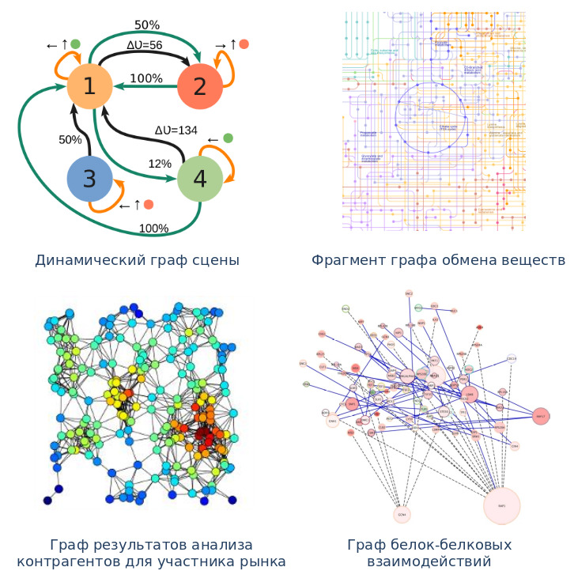

****
# 1. Графы знаний <a name="1"></a>


## 1.1. Актуальность создания эффективных программных и аппаратных средств обработки графов <a name="1_1"></a>


Граф $G(X,E)$ – множество вершин $X$, на элементах которого определены двуместные **отношения смежности** (ребра) – $ ( x_i, x_j ) \in E$, где $ x_i, x_j \in X$ (обратите внимание на наличие скобок в первом выражении и их отсутствие во втором). Тогда пара вершин, находящихся в отношении смежности, рассматривается как ребро $u_k = (x_i, x_j), u_k \in U$. Вершина $x_i$ смежна вершине $x_j$ тогда и только тогда, когда существует ребро $u_k$, **инцидентное** $x_i$, такое, что $x_j$ **инцидентно** ему. Аналогично ребру $u_k$ смежно ребро $u_l$ тогда и только тогда, когда существует вершина $x_i$, **инцидентная ребру** $u_k$, такая, что $u_l$ **инцидентно** этой вершине.

Существует несколько видов графов, отличающихся свойствами предикатов инцидентности – *неориентированные, ориентированные, гипер- и ультраграфы, метаграфы*. 


**Рисунок 1 — Виды графов**

Графы знаний является способом представления модели знаний в виде графовой структуры. Технологии представления и обработки знаний в виде графов приобрели большое значение во многих областях, в которых другие методы показали низкую эффективность. Благодаря способности сохранять информацию о различных объектах и явлениях и учитывать связи между ними, графы знаний могут использоваться при анализе больших данных в биоинформатике \[[1](https://www.researchgate.net/publication/51083566_Using_graph_theory_to_analyze_biological_networks)\], в персонифицированной медицине, системах безопасности городов \[[2](https://www.researchgate.net/publication/349236112_A_Metamodel_and_Framework_for_Artificial_General_Intelligence_From_Theory_to_Practice)\]\[[3](https://www.researchgate.net/publication/335444390_A_reasoning_based_model_for_anomaly_detection_in_the_Smart_City_domain)\]\[[4](https://www.researchgate.net/publication/321306827_A_Survey_on_Network_Embedding)\]\[[5](https://cs.stanford.edu/people/jure/pubs/graphrepresentation-ieee17.pdf)\]\[[6](https://www.researchgate.net/publication/332881469_ConceptNet_55_An_Open_Multilingual_Graph_of_General_Knowledge)\], в компьютерных сетях, финансовом секторе, при контроле сложного промышленного производства, для анализа информации социальных сетей и во многих других областях.  

Существенное влияние на эффективность применения аппаратных средств в задачах обработки графов оказывает адекватность их применения в рамках парадигмы рассматриваемой вычислений. Так, ряд задач обработки графов основан на статических графах, изменение которых либо не предусматривается вообще, либо происходит за пределами графового вычислителя. Для такого класса задач обработки графов характерным является этап передачи графа из исходного места хранения в оперативное хранилище графового вычислителя или же потоковая обработка. Подобная обработка  позволяет применять классические варианты построения вычислительных систем, в которых передача данных происходит большими или непрерывными пакетами, а останов ритмичной обработки не предусматривается спецификой алгоритмов. Для решения данного класса задач хорошо зарекомендовали себя графические ускорители GPU \[[7](http://infolab.dgist.ac.kr/~mskim/papers/SIGMOD16.pdf)\] и матрично-конвейерные структуры на ПЛИС \[[8](https://readingxtra.github.io/docs/graph-fpga/07544758.pdf)\]. 
Второй вариант постановки задач обработки графов отличается тем, что информация графа должна меняться как под воздействием внутренней обработки (например, результата поиска кратчайшего пути или центральных вершин), так и под воздействием внешних факторов (запросов на изменение информации графов). В этом случае граф должен находится непосредственно в оперативной памяти (памяти процессора общего назначения или специального устройства обработки графов). Такой вариант предполагает непрерывность процессов обработки и изменения, что приводит к необходимости применения иных архитектурных принципов.  Вычислительные средства, эффективно воплощающие подобную функциональность, опираются на оптимизацию алгоритмов доступа к структурам данных и графам в памяти, на повышение эффективности подсистемы памяти, на увеличение степени параллельность при обработке каждой нити вычислений. 

Приведенные выше различия статических и динамических задач обработки графов приводят к тому, что несмотря на большое количество и разнообразие средств вычислительной техники, потребность в высокопроизводительных ЭВМ для решения задач обработки графов знаний, чрезвычайно высока. При решении подобных задач дальнейшее увеличение скорости обработки на основе универсальных микропроцессорных систем трудно достижимо.  Даже благодаря высокому уровню параллелизма, глубокой конвейеризации и большим тактовым частотам современные микропроцессоры и графические ускорители не способны эффективно решать проблемы обработки больших графов. Сказываются такие фундаментальные проблемы, как: зависимости по данным \[[9](https://www.proquest.com/openview/de3e03b91bb1bf566067b332f3012c96/1?pq-origsite=gscholar&cbl=2029993)\]\[[10](https://www.semanticscholar.org/paper/Visualizing-effect-of-dependency-in-superscalar-Patel-Kumar/468bc56b8ee79301b4930451c28bfdb8c579d899)\]; необходимость распределения вычислительной нагрузки при обработке нерегулярных графов; наличия конфликтов при доступе к памяти большого количества обрабатывающих ядер \[[11](http://cdn.iiit.ac.in/cdn/cvit.iiit.ac.in/papers/Pawan07accelerating.pdf)\]. 

В МГТУ им. Н.Э.Баумана в настоящее время создается вычислительный комплекс, предназначенного для обработки графов и обладающего передовыми техническими характеристиками: аппаратная реализация набора команд дискретной математики, гетерогенная архитектура, хранение и обработка до 1 триллиона вершин графа. В ходе практикума все участникам будет предоставлен доступ к одной карте комплекса Тераграф.


## 1.2. Пименения графов в задачах аналитики данных и искусственном интеллекте <a name="1_2"></a>

Безусловным достижением последнего десятилетия является внедрение систем анализа данных на основе алгоритмов и методов машинного обучения. Эти технологии позволяют решить одну из важнейших задач: выявление фактов из огромного потока данных. Следующим звеном в цепи интеллектуального анализа данных должна будет система, способная хранить и обрабатывать найденные  факты и связи между ними в виде графов знаний (рисунок 2). 


**Рисунок 2 — Аналитическая система на основе графов знаний**

Уже сейчас оказывается недостаточным просто хранить огромные массивы фактов и извлекать их по запросу. Необходимо иметь систему, способную анализировать причинно-следственные связи между событиями, оценивать достоверность и полноту сведений, выявлять и хранить контекстную информацию.  Именно графы позволяют получать ответы на те вопросы, которые интересуют пользователя такой системы. Например, насколько вероятно развитие дорожной обстановки по неблагоприятному сценарию и как его избежать, имеют ли место незаконные финансовые операции, кто в них задействован и какие схожие сценарии возможны? При этом подход к формированию ответов на такие вопросы должен принципиально отличаться от простого поиска ситуаций похожих на те, что система видела раньше (как это делается сейчас в нейронных сетях).  Аналитическая система будущего должна не просто искать сходства и различия, но уметь логически рассуждать на основе графов знаний. В этом смысле, все известные системе факты и правила будут использоваться для принятия решения. Использование логического вывода на основе графов способно избавить аналитическую систему от ошибок, связанных с игнорированием контекста и здравого смысла, и, главное, делает результат объяснимым. 



**Рисунок 3 — Примеры графов знаний**

Важность повышения эффективности алгоритмов на графах и совершенствования вычислительных средств для их реализации привели к появлению такого направления как **Graph Data Science**. Это подразумевает выделение в отельную научную область инересов всего, что связано с аналитикой данных с использованием графов. В набор средств анализа входят такие алгоритмы, как: обнаружение сообществ в графах, центральность, поиск подобия и изоморфизм, поиска кратчайших путей и максимлаьных потоков, и ряд других. Приведем некоторые примеры применения графовых алгоритмов для решения важных практических задач.


**Обнаружение незаконных финансовых операций** 

Мошенники делят грязные деньги на множество малых частей и смешивают их с законными средствами, и затем превращают их в легальные активы. Для этого используется круговое движение денежных средств, которое скрывает первоначальный источник за длинной цепочкой транзакций. Графы позволяют построить модель движения денег для таких мошеннических схем и своевременно препятствовать им.

**Обнаружение финансового мошенничества в реальном времени**

Все банки стремятся ускорить доступ клиентов к услугам и денежным переводам, что представляет собой потенциальную опасность. Необходимо анализировать множество факторов, сопровождающих транзакцию: местоположение клиента и ip адрес устройства; расстояние до предыдущего места нахождения клиента и время, прошедшее с этого момента; номер карты и счета клиента; история расходов клиента по карте и многое другое. Эти данные формируют графовую структуру, позволяя банку оценить отношения событий и имеющихся в его распоряжении данных.

**Контроль мошеннической деятельности в налоговой сфере**

Системы налогообложения и выявление неуплаты налогов должны постоянно совершенствоваться, чтобы учитывать новые способы ухода от уплаты налогов и мошеннические схемы. С повышение доступности предпринимательства и автоматизацией бизнес-деятельности у преступников появились дополнительные возможности создания подставных юридических лиц, через которых передаются незаконно полученные денежные средства. Графы позволяют анализировать сложные схемы использования подставных юридических лиц и обнаружить мошенническую схему по структуре и взаимосвязи субъектов, участвующих в бизнес-деятельности. Подозрительные паттерны быстро обнаруживаются и выявляются структурные закономерности, которые позволяют установить единый центр мошеннической деятельности.

**Промышленное производство и контроль жизненного цикла оборудования**

Современное промышленное производство основано на длинных цепочках поставок. При этом сроки поставок и жизненный срок изделий различных поставщиков может отличаться. Если представить масштабы работы таких технически сложных объектов, как энергосеть региона или даже страны, становится понятным сложность планирования и модернизации их работы. Необходимо учесть взаимное влияние возможных отказов оборудования, сложность и стоимость их замены, гарантийный срок службы и т.д. Графы позволяют создать модель таких сложных систем и осуществлять управление ими.

**Персонифицированная медицина**

Графы хорошо подходят для хранения и визуализации медицинской информации. Данные о состоянии организма пациента являются взаимосвязанными, и могут быть соотнесены с аналогичными данными других пациентов. Компания AstraZeneca провела успешные исследования, в которых граф знаний об организме одного члена “сообщества” использовался при выборе терапии для больного по аналогии с другими подобными случаями.

**Биомедицинские исследования**

Цепочки химических реакций также представимы в виде графов, в связи с чем в биологии и биомедицине стоит проблема моделирования подобных структур. Обмен веществ в организме человека - это также сеть химических реакций, катализируемых ферментами. В настоящее время изучены более 10 тысяч различных химических реакций, которые происходят в организме для построения клеточных структур. С помощью графов можно описать метаболизм как круговорот атомов, представив в них все реакции с химической структурой небольших соединений (метаболитов). Это, в свою очередь, открывает перед исследователями возможности синтеза новых лекарственных препаратов. 


## 1.3. Переход от реляционной к графовой форме представления информации <a name="1_3"></a>


# 2. Структура микропроцессора Леонард Эйлер и вычислительного комплекса Тераграф <a name="2"></a>

Анализ графов существенно отличается от привычной арифметико-логической обработки. Самыми существенными особенностями алгоритмов обработки графов являются: 

*  зависимости по данным между последовательными итерациями поиска и анализа информации

*  большее количество операций доступа к памяти по сравнению с количеством арифметико-логических операций. 

Поэтому в МГТУ им. Н.Э.Баумана была разработана специальная гетерогенная архитектура вычислительный комплекс `Тераграф`, учитывающая особенности обработки графов. Отличительными чертами комплекса являются:

1.  Доступ к графам и их обработку осуществляет специализированный микропроцессор `lnh64` с набором команд дискретной математики (`Discrete mathematics instruction set computer`, `DISC`).

2.  Оперативное хранилище графов (так называемая `Локальная память структур`, `Local Structure Memory`, `LSM`) имеет большой размер (2.5 ГБ на один микропроцессор `lnh64`) и организована как ассоциативная память.

3.  `DISC` микропроцессор `lnh64` подключен непосредственно к шине памяти малого арифметического процессора `riscv32im`. Пара процессоров `lnh64` и `riscv32im` и составляет гетерогенное ядро обработки графов (`Graph Processing Core`, `GPC`).

4.  Множество гетерогенных ядер обработки графов `GPC` составляют многоядерный микропроцессор `Леонард Эйлер` (также обозначается как `Structure Processing Unit`, `SPU`).


Рассмотрим структуру комплекса Тераграф более подробно.


## 2.1. Набор команд дискретной математики <a name="2_1"></a>


Ключевым вопросом при проектировании любого программно-управляемого устройства является выбор набора команд. Так как целями создания микропроцессорного ядра lnh64 являются аппаратная поддержка дискретной математики, набор инструкций составлен на основе таких понятий, как кванторы, отношения и операции над множествами.

**Таблица 1 – Соответствие инструкций DISC функциям, кванторам и операциям дискретной математики**

| Функции, кванторы и операции дискретной математики | Инструкции набора команд DISC |
|----------------------------------------------------|-------------------------------|
| Функция хранения кортежа                           | INS                           |
| Функция отношения элементов множества              | NEXT,PREV,NSM,NGR,MIN,MAX     |
| Мощность множества                                 | CNT                           |
| Функция принадлежности элемента множеству          | SRCH                          |
| Добавление элемента в множество                    | INS                           |
| Исключение элемента из множества                   | DEL,DELS                      |
| Исключение подмножества из кортежа                 | DELS                          |
| Включение подмножества в кортеж                    | INS,LS,GR,LSEQ,GREQ,GRLS      |
| Отношение эквивалентности множеств                 | INS,LS,GR,LSEQ,GREQ,GRLS      |
| Объединение множеств                               | OR                            |
| Пересечение множеств                               | AND                           |
| Разность множеств                                  | NOT                           |


Последняя версия набора команд DISC состоит из 21 высокоуровневой инструкции, перечисленных ниже:

*  Search (*SRCH*) выполняет поиск значения, связанного с ключом.

*  Insert (*INS*) вставляет пару ключ-значение в структуру. SPU обновляет значение, если указанный ключ уже находится в структуре.

*  Операция Delete (*DEL*) выполняет поиск указанного ключа и удаляет его из структуры данных.

*  Последняя версия набора команд была расширена двумя новыми инструкциями (*NSM* и *NGR*) для обеспечения требований некоторых алгоритмов. Команды *NSM/NGR* выполняют поиск соседнего ключа, который меньше (или больше) заданного и возвращает его значение. Операции могут быть использованы для эвристических вычислений, где интерполяция данных используется вместо точных вычислений (например, кластеризация или агрегация).

*  Maximum /minimum  (*MAX, MIN*) ищут первый или последний ключи в структуре данных.

*  Операция Cardinality (*CNT*) определяет количество ключей, хранящихся в структуре.

*  Команды *AND, OR, NOT* выполняют объединения, пересечения и дополнения в двух структурах данных.

*  Срезы (*LS, GR, LSEQ, GREQ, GRLS*) извлекают подмножество одной структуры данных в другую.

*  Переход к следующему или предыдущему (*NEXT, PREV*) находят  соседний (следующий или предыдущий) ключ в структуре данных относительно переданного ключа. В связи с тем, что исходный ключ должен обязательно присутствовать в структуре данных, операции *NEXT/PREV* отличаются от *NSM/NGR*.

*  Удаление структуры (*DELS*) очищает все ресурсы, используемые заданной структурой.

*  Команда Squeeze (*SQ*) дефрагментирует блоки локальной памяти, используемые структурой. 

*  Команда Jump (*JT*) указывает код ветвления, который должен быть синхронизирован с хост CPU (команда доступна только в режиме МКОД при синхронной обработке данных CPU и SPU в составе вычислительного комплекса).

Вызов команд lnh64 осуществляется передачей из микропроцессора riscv32im операндов и кода операции. Результаты выполнения команд сохраняются в регистрах резельтата (ключ и значение) и регистре статуса. Дополнительно предусмотрена очередь результатов, содержащая аналогичные данные, расположенные последовательно в порядке завершения инструкций. Другим способом передачи результата являются так называемые регистры mailbox.

> Механизм ожидания результатов mailbox предполагает наличие регистров, чтение данных из которых возможно только при поступлении в них действительных значений результатов. В случае, если регистр не содержит результатов, чтение из него вызывает ошибку доступа, или же приостанавливает транзакцию на шине. После прочтения, результат регистра mailbox аннулируется (сбрасывается флаг достоврености).

Примеры вызова команд и ожидания результатов будут рассмотрены в практической части работы.


## 2.2. Структура вычислительного комплекса Тераграф <a name="2_2"></a>


Комплекс «Тераграф» предназначен для хранения и обработки графов сверхбольшой размерности и будет применяться для моделирования биологических систем, анализа финансовых потоков в режиме реального времени, для хранения знаний в системах искусственного интеллекта, создания интеллектуальных автопилотов с вункциями анализа дорожной обстановки, и в других прикладных задачах. Он способен обрабатывать графы сверхбольшой размерности до 10<sup>12</sup> (одного триллиона) вершин и 2·10<sup>12</sup> ребер. Комплекс состоит из 3-х однотипных гетерогенных узлов, которые взаимодействуют между собой через высокоскоростные сетевые подключения 100Gb Ethernet. Каждый узел состоит из хост-подсистемы, подсистемы хранения графов, подсистемы коммутации узлов, а также подсистемы обработки графов. Структурная схема одного узла представлена на рисунке 4


**Рисунок 4 — Структура гетерогенного узла**

Комплекс Терраграф организован по следующим принципам:

*   для ускорения обмена данными внутри комплекса устройства обработки множеств и структур данных размещаются на одном кристалле с универсальными процессорным устройством;

*   совместно на одном кристалле размещается несколько DISC устройств, которые имеют независимые каналы памяти;

*   несколько гетерогенных вычислительных узлов объединены в единый комплекс высокоскоростными сетевыми интерфейсами, обеспечивающими взаимодействие DISC устройств и подсистемы памяти.

### 2.2.1. Хост-подсистема <a name="2_2_1"></a>

Основная вычислительная системы (так называемая хост-подсистема) берет на себя управления запуском вычислительных задач, поддержкой сетевых подключений, обработкой и балансировкой нагрузки. В хост-подсистему входят два многоядерных ЦПУ по 26 ядер каждый, оперативная память на 1 Тбайт и дополнительная энергонезависимая память на 8 Тбайт, где хранятся атрибуты вершин и ребер графа, буферизируются поступающие запросы на обработку и визуализацию графов, хранятся временные данные об изменениях в графах. В хост-подсистеме используется процессор с архитектурой x86 для обеспечения сетевого взаимодействия и связи системы с внешним миром. В функции хост-подсистемы входят:

*   на стадии инициализации комплекса: настройка сетевой подсистемы, подсистем хранения и обработки графов;

*   на стадии создания/изменения графов в локальной памяти подсистемы обработки графов: реализация очередей запросов на вставку/изменения, балансировка запросов к DISC системам, выделение и освобождение структур, контроль выполнения операций изменения;

*   на стадии запуска алгоритмов оптимизации: буферизация запросов оптимизации, инициализация процедур обработки, их запуск и контроль исполнения;

*   на стадии визуализации графов: буферизация запросов на визуализацию, настройка процедур формирования представлений графов для пользовательских процессов, запуск формирования представлений и контроль результатов, буферизация и передача представлений или изменений в представлениях пользовательским процессам.

Указанные функции реализованы в Программном ядре хост-подсистемы (host software kernel) – программном обеспечении, взаимодействующим с подсистемой обработки графов через шину PCIe. 

### 2.2.2. Подсистема хранения графов <a name="2_2_2"></a>

В подсистему хранения графов входят основная память 30Тбайт, состоящая из четырех NVMe SSD дисков по 7,7 Тбайт каждый. Технология NVMe (Non-Volatile Memory Express) обеспечивает интерфейс связи с увеличенной полосой пропускания, что повышает производительность и эффективность обработки графов.

### 2.2.3. Подсистема коммутации узлов <a name="2_2_3"></a>
 
Подсистема коммутации узлов представляет собой два сетевых модуля связи по протоколу 100Gb Ethernet, позволяющих организовать соединение каждого гетерогенного узла с каждым другим узлом комплекса. Шина PCIe обеспечивает высокопроизводительное взаимодействие хост-подсистемы с процессорами Леонард Эйлер, а также последних с подсистемой хранения графов.

### 2.2.4. Подсистема обработки графов <a name="2_2_4"></a>
 
Подсистема обработки графов каждого узла комплекса состоит из 3-х или 4-х карт (в зависимости от версии комплекса) многоядерных микропроцессоров Леонард Эйлер, каждый из которых в свою очередь включает 3 или 4 группы гетерогенных ядер (так называемых Core Groups, CG). В каждую такую группу входят от 2-х до 6-ти ядер DISC GPC, обладающих следующими характеристиками: объем доступной локальной памяти для хранения графов - до 2.5 Гбайт; разрядность ключей и значений - 64 бита; количество хранимых ключей и значений - до 117 миллионов; количество одновременно хранимых структур в локальной памяти структур - до 7;  объем ОЗУ CPE - 64 КБайт. Взаимодействие гетерогенных DISC ядер и хост-подсистемы осуществляется как через FIFO буферы, так и через адресуемую Глобальную память (Global memory, GM) размером 128 Кбайт, что позволяет выбирать наиболее эффективный механизм взаимодействия. 

Таким образом, комплекс «Тераграф» может содержать до 288 гетерогенных ядра DISC GPC, и хранить в оперативном доступе (в локальной памяти подсистемы обработки графов) до 11 миллиардов вершин. Группа ядер Core Group содержит разделяемый между гетерогенными ядрами контроллеры памяти, которые обеспечивает взаимодействие между GPC и Локальной памятью структур типа DDR4, а также с Глобальной памятью. Один и тот же блок Глобальной памяти используется всеми гетерогенными ядрами группы для передачи данных внутри группы и обмена данными с хост-подсистемой. 

Структурная схема микропроцессора Леонард Эйлер версии 4 представлена на рисунке 5.
В качестве единицы передаваемых данных принят блок размером 4КБ, который передается между хост-подсистемой и группой ядер CG с помощью механизмов прямого доступа к памяти.


**Рисунок 5 — Структура микропроцессора Леонард Эйлер**


## 2.3. Микроархитектура гетерогенного ядра обработки графов <a name="2_3"></a>

Как было отмечено ранее, обработка графов в системе Тераграф выполняется на многочисленных гетерогенных ядрах, состоящих из двух микропроцессоров: CPE и SPE (см. рисунок 6). При этом CPE является универсальным RISC  ядром с арифметическим набором команд, в то время как SPE реализует набором команд дискретной математики. 
Каждый вычислительный элемент CPE состоит из очереди команд, блока выборки, блока декодирования команд, модуля предсказания переходов, арифметико-логического устройства, устройства доступа в память, интерфейса AXI4MM, блока ветвлений и интерфейса шины ускорителя AXL. Также вычислительный элемент связан шиной памяти с ПЗУ, в которой записан загрузчик, обеспечивающий передачу программных ядер. Для размещения программ и данных, каждый CPE имеет оперативную память размером 64КБ.


**Рисунок 6 — Структура ядра обработки графов**

Под управлением поступающих из хост-подсистемы команд SPE выполняет хранение ключей и значений в многоуровневой подсистеме памяти, выполняет поиск, изменение и выдачу информации другим устройствам комплекса. Для ускорения поиска и обработки всего набора команд микропроцессор использует внутреннее представление множеств в виде B+деревьев, для которых возможна параллельная обработка нескольких вершин дерева как на промежуточных уровнях, используемых для поиска,так и на нижнем уровне, хранящем непосредственно ключи и значения.


## 2.4. Принципы взаимодействия микропроцессора Леонард Эйлер и хост-подсистемы<a name="2_4"></a>

Основу взаимодействия подсистем при обработке графов составляет передача блоков данных и коротких сообщений между GPC и хост-подсистемой. Для передачи сообщений для каждого GPC реализованы два аппаратных FIFO буфера на 512 записей: Host2GPC для передачи от хост-подсистемы к ядру, и GPC2Host для передачи в обратную сторону.

Обработка начинается с того, что собранное программное ядро (software kernel) загружается в локальное ОЗУ одного или нескольких CPE (микропроцессора riscv32im). Для этого используется механизм прямого доступа к памяти со стороны хост-подсистемы. В свою очередь, GPC (один или несколько) получают сигнал о готовности образа software kernel в Глобальной памяти, после чего вызывается загрузчик, хранимый в ПЗУ CPE. Загрузчик выполняет копирование программного ядра из Глобальной памяти в ОЗУ CPE и передает управление на начальный адрес программы обработки. Предусмотрен режим работы GPC, при котором во время обработки происходит обмен данными и сообщениями. Эти два варианта работы реализуется через буферы и очереди соответственно. На рисунке 7 представлена диаграмма последовательностей первого сценария работы – вызов обработчика с передачей параметров и возвратом значения через очередь сообщений.


**Рисунок 7 — Диаграмма последовательностей вызова обработчика с передачей параметров и возвратом значения через очередь сообщений**


Если код программного ядра уже загружен в ОЗУ CPE, хост-подсистема может вызвать любой из содержащихся в нем обработчиков. Для этого в GPC передает оговоренный UID обработчика (handler), после чего передается сигнал запуска (сигнал START). В ответ CPE устанавливает состояние BUSY и начинает саму обработку. В ходе обработки ядро может обмениваться сообщениями с хост-подсистемой через очереди (команды mq_send и mq_receive). По завершении обработки устанавливается состояние IDLE и вырабатывается прерывание, которое перехватывается хост-подсистемой. Далее, пользовательское приложение хост-подсистемы уведомляется о завершении обработки и готовности результатов.

Если во время работы над кодом обработчика программному ядру software kernel требуется осуществить передачу больших блоков данным между CPE и хост-подсистемой, то может быть задействована Глобальная память и внешняя память большого размера (External Memory, до 16ГБ). Указанные варианты взаимодействия предполагает выделение и освобождение буферов и передачу указателей на них от хост-подсистемы к CPE. Соответствующая диаграмма последовательностей представлена на рисунке 8. 


**Рисунок 8 — Диаграмма последовательностей вызова обработчика с передачей параметров и возвратом значения через буфер в памяти сообщений**


На приведенном примере хост-подсистема передает информацию (ключ поиска) через буфер в глобальную память. Далее, происходит процесс инициализации асинхронной работы путем отправки UID обработчика в GPC (handler UID). Далее хост-подсистема может продолжить передачу данных, получая подтверждения от процесса обработчика GPC через очередь сообщений. Как правило, обработчик, запущенный в CPE, активно вызывает DISC команды SPE, передает данные и получает результаты от SPE в хост-подсистему. В конце работы, обработчик передает результаты обратно в хост-подсистему с использованием очереди сообщений или Глобальной памяти.


## 2.5. Библиотека [leonhard x64 xrt](https://gitlab.com/leonhard-x64-xrt-v2) <a name="2_5"></a>


Библиотека [leonhard x64 xrt](https://gitlab.com/leonhard-x64-xrt-v2) представляет собой API системного уровня, реализующего функциональные возможности по инициализации подсистемы обработки графов и взаимодействию с микропроцессором lnh64 DISC. Библиотека разделена на две части, представленные в таблице 2.

**Таблица 2 - Описание частей библиотеки leonhard x64 xrt**

| Раздел библиотеки                                                     | Описание                                                    | Язык программирования | Архитектура, Компилятор |
|-----------------------------------------------------------------------|-------------------------------------------------------------|-------------------------------------------------|
| [Host Lib](https://gitlab.com/leonhard-x64-xrt-v2/libraries/host-lib) |   Управления хост-подсистемой и взаимодействие с ядрами GPC | C++, объектная модель | x86, g++                |
| [SW Kernel Lib](https://gitlab.com/leonhard-x64-xrt-v2/libraries/sw-kernel-lib) | Взаимодействие с микропроцессором lnh64           | C, процедурная модель | riscv32, g++            |

Функциональные возможности Host Lib:

*   Настройка параметов в зависимости от версии микропроцесора Леонард Эйлер. 

*   Начальная инициализация аппаратной части, конфигурирование ПЛИС микропроцессором Леонард Эйлер. 

*   Инициализация буферов и очередей для взаимодействия хост-подсистемы и подсистемы обработки графов (ядер обработки графов GPC).

*   Передача и прием данных и сообщений к/от GPC через общую память и аппаратные очереди.

Функциональные возможности SW Kernel Lib:

*   Обмен данными и сообщениями с хост-подсистемой.

*   Установка состояние sw_kernel (IDLE,BUSY).

*   Запуск обработчиков на ядре riscv32im.

*   Передача опрандов и кодов операций в микропроцессор lnh64.

*   Контроль результатов исполнения DISC команд.


Ниже приведен пример кода программы хост-подсистемы, выполняющей инициализацию и измерение тактовой частоты GPC.

```
	//Общесистемные библиотеки
	#include <iostream>
	#include <stdio.h>
	#include <stdexcept>
	#include <iomanip>
	#include <unistd.h>
	#include <sys/time.h>
	//Библиотеки Xilinx Runtime Library
	#include "experimental/xrt_device.h"
	#include "experimental/xrt_kernel.h"
	#include "experimental/xrt_bo.h"
	#include "experimental/xrt_ini.h"
	//Библиотека leonhard x64 xrt
	#include "gpc_defs.h"
	#include "leonhardx64_xrt.h"
	#include "gpc_handlers.h"

	int main(int argc, char** argv)
	{

		// Приложение запскается с параметрами: <xclbin> <sw_kernel>
		// <xclbin>    - путь к бинарному файлу прошивки ПЛИС Ultrascale+ с проектом Леонард Эйлер
		// <sw_kernel> - путь к бинарному файлу sw_kernel в формате rawbinary

		unsigned int err = 0;
		unsigned int cores_count = 0;
		float LNH_CLOCKS_PER_SEC;

		//Использование макроса __foreach_core для определения количества доступных ядер
		__foreach_core(group, core) cores_count++;

		//Проверка передаваемых параметров
		if (argc < 3) {
			usage();
			throw std::runtime_error("FAILED_TEST\nNo xclbin or sw_kernel specified");
		}

		//Инициализация карты #0 и конфигурирование ускорителя
		leonhardx64 lnh_inst = leonhardx64(0,argv[1]);

		//Иницилиация программных ядер во всех GPC
		__foreach_core(group, core)
		{
			lnh_inst.load_sw_kernel(argv[2], group, core);
		}

		/*
		 *
		 * Чтение номера версии и статуса из микропроцесосра lnh64 каждого GPC
		 *
		 */

		__foreach_core(group, core)
		{
			printf("Group #%d \tCore #%d\n", group, core);
			// Запуск обработчика get_version() в sw_kernel
			lnh_inst.gpc[group][core]->start_sync(__event__(get_version));
			// Получение сообщения о номере версии (метод класса leonhardx64.mq_receive())
			printf("\tSoftware Kernel Version:\t0x%08x\n", lnh_inst.gpc[group][core]->mq_receive());
			// Запуск обработчика get_lnh_status_high() в sw_kernel
			lnh_inst.gpc[group][core]->start_sync(__event__(get_lnh_status_high));
			// Получение сообщения со значением старшей части регистра статуса 
			printf("\tLeonhard Status Register:\t0x%08x", lnh_inst.gpc[group][core]->mq_receive());
			// Получение сообщения со значением младшей части регистра статуса 
			lnh_inst.gpc[group][core]->start_sync(__event__(get_lnh_status_low));
			printf("_%08x\n", lnh_inst.gpc[group][core]->mq_receive());
		}


		/*
		 *
		 * Измерение тактовой частоты GPC[0]
		 *
		 */

		// Запуск обработчика frequency_measurement() в sw_kernel
		lnh_inst.gpc[0][LNH_CORES_LOW[0]]->start_async(__event__(frequency_measurement));
		// Команда обмена синхронизирующими сообщениями
		lnh_inst.gpc[0][LNH_CORES_LOW[0]]->sync_with_gpc(); // Start measurement
		// Задержка 1 секунда
		sleep(1);
		// Команда обмена синхронизирующими сообщениями
		lnh_inst.gpc[0][LNH_CORES_LOW[0]]->sync_with_gpc(); // Start measurement
		// Ожидание завершения работы обработчика
		lnh_inst.gpc[0][LNH_CORES_LOW[0]]->finish();
		// Чтение сообщения из очереди сообщений
		LNH_CLOCKS_PER_SEC = (float)lnh_inst.gpc[0][LNH_CORES_LOW[0]]->mq_receive();
		printf("Leonhard clock frequency (LNH_CF): %u MHz\n", LNH_CLOCKS_PER_SEC / 1000000);

		exit(0);
	}
``` 

Для представленного листинга должен быть также создан и скомпилирован ответный код для микропроцессора riscv32im, который будет работать в составе гетерогенного ядра обработки графов.
В коде должна быть реализована логика установки состояния ядра: одно из двух состояний IDLE или BUSY. Также разработчиком должы быть реализованы обработчики вызываемых из хост-подсистемы функций get_version(), get_lnh_status_high(), get_lnh_status_low(), frequency_measurement().

Номер обработчика может быть задан явным обраом в Xост и sw_kernel частях, однако удобнее использовать механизм автоматической нумерации обработчиков на основе макросов С. Для этого мы будем использовать файл gpc_handkers.h, который должен быть включен как в проект хоста, так и в проект sw_kernel:

```
	#ifndef DEF_HANDLERS_H_
	#define DEF_HANDLERS_H_
	#define DECLARE_EVENT_HANDLER(handler) \
	            const unsigned int event_ ## handler =__LINE__; \
	            void handler ();
	#define __event__(handler) event_ ## handler
	//  Event handlers declarations by declaration line number!!! 
	DECLARE_EVENT_HANDLER(frequency_measurement);
	DECLARE_EVENT_HANDLER(get_lnh_status_low);
	DECLARE_EVENT_HANDLER(get_lnh_status_high);
	DECLARE_EVENT_HANDLER(get_version);
	#endif
```  

Таким образом, условное имя обработчика ставится в однозначное соответствие номеру строки, в которой он объявлен в файле gpc_handlers.h.

В результате получим следующий код основного модуля sw_kernel

```
	#include <stdlib.h>
	#include "lnh64.h"
	#include "gpc_io_swk.h"
	#include "gpc_handlers.h"

	#define VERSION 26
	#define DEFINE_LNH_DRIVER
	#define DEFINE_MQ_R2L
	#define DEFINE_MQ_L2R
	
	// Объявление структур для доступа к ресурсам микропроцессора lnh64
	extern lnh lnh_core;
	// Объявление структур для доступа к глобальной и внешней памяти, и очередям сообщений
	extern global_memory_io gmio;
	volatile unsigned int event_source;

	int main(void) {
	    /////////////////////////////////////////////////////////
	    //          Основной цикл запуска обработчиков
	    /////////////////////////////////////////////////////////
	    //Инициализация микропроцессорного ядра lnh64
	    lnh_init();
	    //Инициализация очередей host2gpc и gpc2host
	    gmio_init(lnh_core.partition.data_partition);
	    for (;;) {
	        //Ожидание события start
	        while (!gpc_start());
	        //Переход в режим BUSY и разрешение ввода/вывода
	        set_gpc_state(BUSY);
	        //Получение номера обработчика 
	        event_source = gpc_config();
	        //Вызов обработчика по номеру
	        switch(event_source) {
	            case __event__(frequency_measurement) : frequency_measurement(); break;
	            case __event__(get_lnh_status_low) : get_lnh_status_low(); break;
	            case __event__(get_lnh_status_high) : get_lnh_status_high(); break;
	            case __event__(get_version): get_version(); break;
	        }
	        //Переход в режим IDLE и запрет вводы/вывода
	        set_gpc_state(IDLE);
	        while (gpc_start());
	    }
	}
	    
	//-------------------------------------------------------------
	//      Глобальные переменные (для сокращения объема кода)
	//-------------------------------------------------------------
	    
	        u64 TSC_start;
	        u64 TSC_stop;
	        u32 interval;

	//-------------------------------------------------------------
	//      Измерение тактовой частоты GPN
	//-------------------------------------------------------------
	 
	void frequency_measurement() {

	        sync_with_host();
	        lnh_sw_reset();
	        lnh_rd_reg32_byref(TSC_LOW,&TSC_start);
	        sync_with_host();
	        lnh_rd_reg32_byref(TSC_LOW,&TSC_stop);
	        interval = TSC_stop-TSC_start;
	        mq_send(interval);
	}

	//-------------------------------------------------------------
	//      Получить версию микрокода 
	//-------------------------------------------------------------
	 
	void get_version() {

	        mq_send(VERSION);
	}

	//-------------------------------------------------------------
	//      Получить регистр статуса LOW Leonhard 
	//-------------------------------------------------------------
	 
	void get_lnh_status_low() {

	        lnh_rd_reg32_byref(LNH_STATE_LOW,&lnh_core.result.status);
	        mq_send(lnh_core.result.status);
	}

	//-------------------------------------------------------------
	//      Получить регистр статуса HIGH Leonhard 
	//-------------------------------------------------------------
	 
	void get_lnh_status_high() {

	        lnh_rd_reg32_byref(LNH_STATE_HIGH,&lnh_core.result.status);
	        mq_send(lnh_core.result.status);
	}
``` 

### 2.5.1. Обмен данными между GPC и хост-подсистемой через глобальную память <a name="2_5_1"></a>


Взаимодействие обработчика sw_kernel и хост-подсистемы может выполняться через Глобальную память размером 128 КБ, распределенную между ядрами одной группы (до 6 ядер, в зависимости от модификации) следующим образом:

**Таблица 3 - Карта распределение глобальной памяти**

| Начальный адрес | Размер     | Назначение                            |
|-----------------|------------|---------------------------------------|
| 0               | 64K        | Буфер для загрузка образов sw_kernel  |
| 64K             | 4K         | Буфер Host2GPC для GPC0               |
| 68K             | 4K         | Буфер GPC2Host для GPC0               |
| 72K             | 4K         | Буфер Host2GPC для GPC1               |
| 76K             | 4K         | Буфер GPC2Host для GPC1               |
| ...             | ...        | ...                                   |
| 120K            | 4K         | Буфер Host2GPC для GPC5               |
| 124K            | 4K         | Буфер GPC2Host для GPC5               |

Распределение адресов в соответствии с картой Глобальной памяти выполняется хост-подсистемой при инициализации управляющего объекта ```leonhardx64 lnh_inst = leonhardx64(0,argv[1]);```. 
После инициализации обмен через Глобальную память может выполняться без какой-либо допонительной инициализации sw_kernel. Так как в основе обмена данными лежит механизм прямого доступа к памяти, необходимо подготовить буфер в пользовательском пространстве памяти хост-подсистемы

Пример кода хост-подсистемы для обмена данными через глобальную память:

```
 //Выделение буфера в RAM хост-посистемы для передачи
 unsigned int *host2gpc_buffer[LNH_GROUPS_COUNT][LNH_MAX_CORES_IN_GROUP];
 __foreach_core(group, core)
        host2gpc_buffer[group][core] = (unsigned int*) malloc(1024*sizeof(int));
 //Запись данных в буферы Host2GPC
 __foreach_core(group, core) 
	    lnh_inst.gpc[group][core]->buf_write(1024*sizeof(int),host2gpc_buffer[group][core]);
 //Передача сигнала о готовности буфера и его размера
 __foreach_core(group, core) {
	    lnh_inst.gpc[group][core]->mq_send(1024*sizeof(int));
```

Пример ответного кода sw_kernel

```
    unsigned int size = mq_receive();
    unsigned int *buffer = (unsigned int*)malloc(size);
    buf_read(size, buffer);
```
Аналогичным образом может быть организована обратная передача через буфер GPC2Host с помощью метода leonhardx64->buf_read (в хост-подсистеме) и buf_write (в sw_kernel).

Если необходимо передавать большие блоки данных, то указанную процедуру можно повторять несколько раз. Органичивающим фактором для повышения размеров буферов является не только незначительный размер Глобальной памяти, но и малый размер RAM CPE riscv32im (64 КБ).

### 2.5.2. Обмен данными между GPC и хост-подсистемой через внешнюю память <a name="2_5_2"></a>

В текущей версии микропроцессора имеется возможность обмена через внешнюю память 16ГБ. Данный способ в дальнейшем использоваться не будет. В текущей версии он может быть использован в ограниченном режиме: размер передаваемого блока не может превосходить 512МБ. Для использования данного механизма требуется выделить буфер соответствующего размера в адресном  пространстве хост-подсистемы и отобразить его на физическое адресное пространство ввода-вывода. Этот механизм реализован в библиотеке leonhard x64 xrt.  

Пример кода хост-подсистемы для обмена данными через внешнюю память:

```
 //Выделение буфера в RAM хост-посистемы для передачи
 char* host2gpc_ext_buffer[LNH_GROUPS_COUNT][LNH_MAX_CORES_IN_GROUP];
 __foreach_core(group, core)
   	    host2gpc_ext_buffer[group][core] = lnh_inst.gpc[group][core]->external_memory_create_buffer(1024*1024*sizeof(int));
 //Отображение буфера в пространство ввода-вывода и запись данных External memory
 __foreach_core(group, core) 
	    lnh_inst.gpc[group][core]->external_memory_sync_to_device(0,8192*sizeof(int));
 //Передача физического адреса начала буфера
 __foreach_core(group, core) {
	    long long tmp = lnh_inst.gpc[group][core]->external_memory_address();
	    lnh_inst.gpc[group][core]->mq_send((unsigned int)tmp);
	}
//Передача сигнала о готовности буфера и его размера
  __foreach_core(group, core) {
	    lnh_inst.gpc[group][core]->mq_send(1024*sizeof(int));
	}
```

Пример ответного кода sw_kernel:

```
    unsigned int buffer_pointer = mq_receive();
    unsigned int size = mq_receive();
    unsigned int *buffer = (unsigned int*)malloc(size);
    ext_buf_read(size, (unsigned int *)buffer_pointer, buffer); 
```
 Обратите внимание, что в данном примере происходит копирование всего переданного буфера в RAM, так что размер передаваемых данных ограничен имеющимся свободным пространством оперативной памяти CPE (менее 64КБ). 

## 2.6. Взаимодействие CPE(riscv32im) и SPE(lnh64)<a name="2_6"></a>

Микропроцессор lnh64 с набором команд дискретной математики (*Discrete Mathematics Instruction Set Computer*) является ассоциативным процессором, т.е. устройством, выполняющим операции обработки над данными, хранящимися в ассоциативной памяти (так называемой Локальной памяти структур). В качестве таковой выступает адресная память DDR4, причем для каждого ядра lnh64 доступны 2.5 ГБ адресного пространства в ней. Для организации ассоциативного способа доступа к адресному устройству микропроцессор lnh64 организует на аппаратном уровне структуру B+дерева. Причем 512МБ занимает древовидая структура от верхнего и до предпоследнего уровня, 2048МБ занимает последний уровень дерева, на котором и хранятся 64х разрядные ключи и значения. Каждый микропроцессор lnh64 может хранить и обрабатывать до 117 миллионов ключей и значений. 

Исходя из этого, обработка множеств или графов представлется в DISC наборе команд, как работа со структурами ключей и значений (key-value). Однако, как было показано ранее при описании наора команд  DISC, в отличие от общепринятых key-value хранилищ, доступны такие операции как ближайший больший (*NGR*), ближайший меньший (*NSM*), команды объединения множеств (*OR*) и ряд других. Это и позволяет использовать lnh64 в качестве устройства, хранящего большие множества (для графов это множества вершин и ребер).


Доступ к микропроцессору lnh64 (Structure Processing Element) осуществляется чтением и записью в пространство памяти микропроцессора riscv32im (Computing Processing Element) в диапазоне 0x60000000 - 0x60001000. Карта памяти представлена в файле [gpc_swk.h](https://gitlab.com/leonhard-x64-xrt-v2/libraries/sw-kernel-lib/-/blob/main/lib/gpc_swk.h):

**Таблица 4. Карта памяти CPE riscv32im**

| Начальный адрес | Размер пространства (байт) | Назначение                                                      |
|-----------------|----------------------------|-----------------------------------------------------------------|
| 0x00000000      | 128                        | ROM - содержит начальный загрузчик (bootloader)                 |
| 0x60000000      | 4K                         | lnh64 - просранство микропроцессора lnh64 с набором команд DISC |
| 0x80000000      | 64К                        | RAM - оперативная память микропроцессора riscv32im              |
| 0xA0000000      | 128К                       | Глобальная память (global memory)                               |
| 0xA0020000      | 4                          | Регистр статуса                                                 |
| 0xA0030000      | 4                          | Регистр управления                                              |
| 0xA0040000      | 4                          | Очередь GPC2HOST                                                |
| 0xA0050000      | 4                          | Очередь HOST2GPC                                                |
| 0xA0060000      | 4                          | Регистр статуса очередей                                        |
| 0xA0060008      | 4                          | Регистр управления очередями                                    |
| 0xA8000000      | 512М                       | Внешняя память (external memory)                                |


### 2.6.1. Программная модель микропроцессора lnh64 <a name="2_6_1"></a>

Микропроцессор lnh64 являются 64-х разрядным, в то время как микропроцессор riscv32im является 32-х разрядным. В связи с этим для всех регистров lnh64 обеспечивается доступ как к младшей так и к старшей частям, используя 32-х разрядную шину памяти. 

Микропроцессор lnh64 получает на вход команды 6 различных форматов. Так, для команды вставки *INS* задействуются регистр кода операции, регистр ключа операнда и регистр значения операнда. Результаты выполнения команды является статус ее исполнения, который записывается в регистр статуса. Для команды поиска *SRCH* задействуются регистры ключа операнда и регистр кода операции, а результаты записываются в регистры ключа результата, значения результата и регистр статуса.

Перечень программно-доступных регистров и их смещения в адресном пространстве относительно базового адреса (0x60000000) указан в таблице 5: 


**Таблица 5. Программно досупные регистры lnh64**

| Регистр          | Смещение  | Режим   | Начальное значение  | Назначение                                                                  |
|------------------|-----------|---------|---------------------|-----------------------------------------------------------------------------|
| KEY2LNH_LOW      | 0x0000    | запись  | 0x00000000          | Регистр содержит младшую часть ключа операнда команд DISC                   |
| LNH2KEY_LOW      | 0x0000    | чтение  | 0x00000000          | Регистр содержит младшую часть ключа результата команды DISC                |
| KEY2LNH_HIGH     | 0x0004    | запись  | 0x00000000          | Регистр содержит старшую часть ключа операнда команд DISC                   |
| LNH2KEY_HIGH     | 0x0004    | чтение  | 0x00000000          | Регистр содержит старшую часть ключа результата команды DISC                |
| VAL2LNH_LOW      | 0x0008    | запись  | 0x00000000          | Регистр содержит младшую часть значения операнда команд DISC                |
| LNH2VAL_LOW      | 0x0008    | чтение  | 0x00000000          | Регистр содержит младшую часть значения результата команд DISC              |
| VAL2LNH_HIGH     | 0x000С    | запись  | 0x00000000          | Регистр содержит старшую часть значения операнда команд DISC                |
| LNH2VAL_HIGH     | 0x000С    | чтение  | 0x00000000          | Регистр содержит старшую часть значения результата команд DISC              |
| CMD2LNH_LOW      | 0x0010    | запись  | 0x00000000          | Регистр содержит младшую часть кода операции DISC                           |
| LNH_STATE_LOW    | 0x0010    | чтение  | 0x09110611          | Регистр содержит младшую часть статуса микропроцессора lnh64                |
| CMD2LNH_HIGH     | 0x0014    | запись  | 0x00000000          | Регистр содержит старшую часть кода операции DISC                           |
| LNH_STATE_HIGH   | 0x0014    | чтение  | 0x00000001          | Регистр содержит старшую часть статуса микропроцессора lnh64                |
| CARDINALITY_LOW  | 0x0018    | чтение  | 0x00000000          | Количество ключей в структуре (мл), указанной в поле R регистра CMD2LNH_LOW |
| CARDINALITY_HIGH | 0x001С    | чтение  | 0x00000000          | Количество ключей в структуре (ст), указанной в поле R регистра CMD2LNH_LOW |
| LNH_CNTL_LOW     | 0x0020    | запись  | 0x00000000          | Регистр управления (мл)                                                     |
| LNH_CNTL_HIGH    | 0x0024    | запись  | 0x00000000          | Регистр управления (ст)                                                     |
| LNH2KEYQ_LOW     | 0x0028    | чтение  | 0x00000000          | Очередь ключей результатов команд DISC (мл)                                 |
| LNH2KEYQ_HIGH    | 0x002С    | чтение  | 0x00000000          | Очередь ключей результатов команд DISC (ст)                                 |
| LNH2VALQ_LOW     | 0x0030    | чтение  | 0x00000000          | Очередь значений результатов команд DISC (мл)                               |
| LNH2VALQ_HIGH    | 0x0034    | чтение  | 0x00000000          | Очередь значений результатов команд DISC (ст)                               |
| LNH_STATEQ_LOW   | 0x0038    | чтение  | 0x00000000          | Очередь статуса результатов команд DISC (мл)                                |
| LNH_STATEQ_HIGH  | 0x003С    | чтение  | 0x00000000          | Очередь статуса результатов команд DISC (ст)                                |
| TSC_LOW          | 0x0040    | чтение  | 0x00000000          | Регистр счетчика тактов (мл)                                                |
| TSC_HIGH         | 0x0044    | чтение  | 0x00000000          | Регистр счетчика тактов (ст)                                                |
| СSC_LOW          | 0x0048    | чтение  | 0x00000000          | Регистр счетчика тактов исполнения команд (мл)                              |
| СSC_HIGH         | 0x004C    | чтение  | 0x00000000          | Регистр счетчика тактов исполнения команд (ст)                              |
| DBG_A_LOW        | 0x0050    | чтение  | 0x00000000          | Регистр отладки A (мл)                                                      |
| DBG_A_HIGH       | 0x0054    | чтение  | 0x00000000          | Регистр отладки A (ст)                                                      |
| DBG_B_LOW        | 0x0058    | чтение  | 0x00000000          | Регистр отладки B (мл)                                                      |
| DBG_B_HIGH       | 0x005С    | чтение  | 0x00000000          | Регистр отладки B (ст)                                                      |
| DBG_C_LOW        | 0x0060    | чтение  | 0x00000000          | Регистр отладки C (мл)                                                      |
| DBG_C_HIGH       | 0x0064    | чтение  | 0x00000000          | Регистр отладки C (ст)                                                      |
| DBG_D_LOW        | 0x0068    | чтение  | 0x00000000          | Регистр отладки D (мл)                                                      |
| DBG_D_HIGH       | 0x006С    | чтение  | 0x00000000          | Регистр отладки D (ст)                                                      |
| MR0_LOW          | 0x0080    | чтение  | 0x00000000          | Регистр 0 mailbox с ожиданием результата (мл)                               |
| MR0_HIGH         | 0x0084    | чтение  | 0x00000000          | Регистр 0 mailbox с ожиданием результата (ст)                               |
| MR1_LOW          | 0x0088    | чтение  | 0x00000000          | Регистр 1 mailbox с ожиданием результата (мл)                               |
| MR1_HIGH         | 0x008С    | чтение  | 0x00000000          | Регистр 1 mailbox с ожиданием результата (ст)                               |
| MR2_LOW          | 0x0090    | чтение  | 0x00000000          | Регистр 2 mailbox с ожиданием результата (мл)                               |
| MR2_HIGH         | 0x0094    | чтение  | 0x00000000          | Регистр 2 mailbox с ожиданием результата (ст)                               |
| MR3_LOW          | 0x0098    | чтение  | 0x00000000          | Регистр 3 mailbox с ожиданием результата (мл)                               |
| MR3_HIGH         | 0x009С    | чтение  | 0x00000000          | Регистр 3 mailbox с ожиданием результата (ст)                               |
| MR4_LOW          | 0x00A0    | чтение  | 0x00000000          | Регистр 4 mailbox с ожиданием результата (мл)                               |
| MR4_HIGH         | 0x00A4    | чтение  | 0x00000000          | Регистр 4 mailbox с ожиданием результата (ст)                               |
| MR5_LOW          | 0x00A8    | чтение  | 0x00000000          | Регистр 5 mailbox с ожиданием результата (мл)                               |
| MR5_HIGH         | 0x00AC    | чтение  | 0x00000000          | Регистр 5 mailbox с ожиданием результата (ст)                               |
| MR6_LOW          | 0x00B0    | чтение  | 0x00000000          | Регистр 6 mailbox с ожиданием результата (мл)                               |
| MR6_HIGH         | 0x00B4    | чтение  | 0x00000000          | Регистр 6 mailbox с ожиданием результата (ст)                               |
| MR7_LOW          | 0x00B8    | чтение  | 0x00000000          | Регистр 7 mailbox с ожиданием результата (мл)                               |
| MR7_HIGH         | 0x00BC    | чтение  | 0x00000000          | Регистр 7 mailbox с ожиданием результата (ст)                               |

Регистр управления содержит биты для управления ресурсами lnh64. Биты 0..31 устанавливаются в необходимое состояние записью соответствующего значения в регистр LNH_CNTL_LOW. Биты 32..63 при записи логической 1 выдают одиночный импуль сброса ресурса, после чего автоматически устанавливаются в значение 0.  Назначение бит для регистра управления представлено в таблице 6.

**Таблица 6. Назначение разрядов регистра управления**

| Название               | Бит   | Назначение                                                                     |
|------------------------|-------|--------------------------------------------------------------------------------|
| ALLOW_LNH_FLAG         | 0     | Разрешение работы lnh64                                                        |  
| SUSPEND_Q_FLAG         | 1     | Останов выдачи транзакций из очередизапросов на запись в lnh64                 |  
| LSM_DMA_FLAG           | 2     | Разрешение прямого доступа к LSM                                               |  
| LCM_DMA_FLAG           | 3     | Не используется                                                                |  
| ENABLE_TSC_FLAG        | 4     | Разрешение работы счетчика тактов                                              |  
| ENABLE_READY_INT       | 5     | Не используется                                                                |  
| RESET_MAILBOX[0]       | 32    | Запуск импульса сброса регистра mailbox[0]                                     |
| RESET_MAILBOX[1]       | 33    | Запуск импульса сброса регистра mailbox[1]                                     |
| RESET_MAILBOX[2]       | 34    | Запуск импульса сброса регистра mailbox[2]                                     |
| RESET_MAILBOX[3]       | 35    | Запуск импульса сброса регистра mailbox[3]                                     |
| RESET_MAILBOX[4]       | 36    | Запуск импульса сброса регистра mailbox[4]                                     |
| RESET_MAILBOX[5]       | 37    | Запуск импульса сброса регистра mailbox[5]                                     |
| RESET_MAILBOX[6]       | 38    | Запуск импульса сброса регистра mailbox[6]                                     |
| RESET_MAILBOX[7]       | 39    | Запуск импульса сброса регистра mailbox[7]                                     |
| RESET_SPU              | 48    | Сброс lnh64 в начальное состояние (мягкий сброс)                               |
| RESET_ALL_QUEUES       | 49    | Сброс состояния всех очередей                                                  |
| RESET_LNH2AXI_QUEUE    | 50    | Сброс очереди запросов на чтение lnh64                                         |
| RESET_AXI2LNH_QUEUE    | 51    | Сброс очереди запросов на запись lnh64                                         |
| RESET_TSC              | 52    | Сброс счетчика тактов                                                          |
| RESET_RISCV            | 53    | Аппаратный сброс lnh64 в начальное состояние                                   | 

Регистр статуса позволяет отслеживать готовность результатов выполнения операций (готовность, наличие ошибки), состояние очередей, версию аппаратного обеспечения и ряд других парамтеров. Назначение бит для регистра статуса представлено в таблице 7.


**Таблица 7. Назначение разрядов регистра статуса**

| Название               | Бит   | Назначение                                                                  |
|------------------------|-------|-----------------------------------------------------------------------------|
| SPU_READY_FLAG         | 0     |  Флаг завершения команды/готовности к приему команды                        |
| SPU_ERROR_FLAG         | 1     |  Флаг ошибки выполнения команды                                             |
| SPU_ERROR_Q_FLAG       | 2     |  Флаг ошибки выполнения команды в очереди статуса результатов               |
| DDR_Q_OVF_FLAG         | 3     |  Флаг переполнения очереди к DDR LSM памяти                                 |
| DDR_TEST_SUCC_FLAG     | 4     |  Результат верификации контролера памяти DDR4 (не использован) = 0          |
| NU                     | 5-8   |  Не использованы                                                            |
| SPU_ALL_DONE           | 9     |  Очередь команд пуста и последняя команда исполнена                         |
| AXI2LNH_Q_EMP_FLAG     | 16    |  Очередь запросов на запись пуста                                           |
| AXI2LNH_Q_FULL_FLAG    | 17    |  Очередь запросов на запись переполнена                                     |
| AXI2LNH_Q_AEMP_FLAG    | 18    |  Очередь запросов на запись наполовину пуста (содержит <256 значений)       |
| AXI2LNH_Q_AFULL_FLAG   | 19    |  Очередь запросов на запись наполовину заполнена (содержит >256 значений)   |
| LNH2AXI_Q_EMP_FLAG     | 20    |  Очередь запросов на чтение пуста                                           |
| LNH2AXI_Q_FULL_FLAG    | 21    |  Очередь запросов на чтение переполнена                                     |
| LNH2AXI_Q_AEMP_FLAG    | 22    |  Очередь запросов на чтение наполовину пуста (содержит <256 значений)       |
| LNH2AXI_Q_AFULL_FLAG   | 23    |  Очередь запросов на чтение наполовину заполнена (содержит >256 значений)   |
| MBOX_VFLAG             | 32-40 |  Биты готовности операндов в регистрах mailbox[0..7], 1 - готовность        |
| LNH_DATA_PARTITION     | 48-50 |  Номер партиции DDR данных нижнего уровня B+дерева (0..7)                   |
| LNH_INDEX_PARTITION    | 51-53 |  Номер партиции DDR индексной части B+дерева (0..7)                         |
| LNH_INDEX_REGION       | 54-55 |  Номер региона DDR индексной части B+дерева в LNH_INDEX_PARTITION (0..3)    |


### 2.6.2. Вызовы и передача операндов команд дискретной математики <a name="2_6_2"></a>

Операции чтения и записи регистров lnh64 в DISC  в библиотеке SW Kernel Lib выполняются с помощью макросов как при помощи непосредственных параметров (по значению), так и с помощью адреса параметра (по ссылке). 


**Таблица 8. Макросы доступа к регистрам lnh64**

| Макрос                              | Назначение                                           |
|-------------------------------------|------------------------------------------------------|
| lnh_wr_reg64_byref(adr, value)      | Запись регистра 64 бит (Адрес, Данные) по ссылке     |
| lnh_wr_reg64_byval(adr, value)      | Запись регистра 64 бит (Адрес, Данные) по значению   |
| lnh_rd_reg64_byref(adr, value)      | Чтение регистра 64 бит (Адрес, Данные) по ссылке     |
| lnh_rd_reg64_byval(adr)             | Чтение регистра 64 бит (Адрес) => Данные по значению |
| lnh_wr_reg32_l2l_byref(adr, value)  | Запись регистра 32 бит (Адрес, Данные) по ссылке     |
| lnh_wr_reg32_byval(adr, value)      | Запись регистра 32 бит (Адрес, Данные) по значению   |
| lnh_rd_reg32_byref(adr, value)      | Чтение регистра 32 бит (Адрес, Данные) по ссылке     |
| lnh_rd_reg32_byval(adr)             | Чтение регистра 32 бит (Адрес) => Данные по значению |


Для ускорения запуска команд, когда по сравнению с предыдущей командой меняется только часть операндов, может применяться функция ``__fast_recall()``, передающая только измененные относительно предыдущей команды операнды и код операции. 

Типичный пример использования макросов для запуска команды на выполнение и ожидание результатов, это команд Вставки (INS) ключа и значения. Для этого, необходимо поверить возможность записи в очередь запросов на запись. При этом ображение к очереди требуется выполнять только в том случае, если исчерпан лимит на количество последовательных операций записи (256 записей). Только в случае превышения лимита проверяется флаг AXI2LNH_Q_AFULL_FLAG. При освобождении половины от имеющего ся места в очереди посылка транзакций возобновлется. 

> Микроархитектура lnh64 допускает обращение к одной из семи независимых структур (1..7). Структур 0 не используется для хранения и зарезервирована.  

Далее происходит запись ключей и значений в регистры  KEY2LNH и VAL2LNH, а также посылка кода операции в регистр CMD2LNH. При этом указывается парамтер str, определяющий номер структуры, в которую должна произойти вставка нового ключа. После записи старшей части регистра CMD2LNH (CMD2LNH_HIGH) происходит запуск команды на исполнение. 

Далее выполняется ожидание готовности (проверяется бит SPU_READY_FLAG регистра статуса), после чего выполняется чтение регистра состояния и анализ результата.
Статус выполнения команды, а для других команд ключ и значение результата записываются в структуру lnh_core.result.

```
//====================================================
// Добавление (Структура, Ключ, Значение)
//====================================================

bool lnh_ins_sync(u64 str, u64 key, u64 value)
{
    //проверка готовности устройства
	    lnh_axi2lnh_queue_credits_check;

    //запись исходных данных
	    lnh_wr_reg64_byref(KEY2LNH, &key);
        lnh_wr_reg64_byref(VAL2LNH, &value);
    	lnh_wr_reg64_byval(CMD2LNH, (INS<<lnh_cmd)|str);

    //ожидание готовности очереди команд
		lnh_sync();

    //чтение результата
	    lnh_rd_reg64_byref(LNH_STATE,&lnh_core.result.status);

    //results
	    if ((lnh_core.result.status & (1<<SPU_ERROR_FLAG)) != 0) {
			return false;
		} else {
			return true;
		}
}

```


# 3. Практическа часть <a name="3"></a>

## Практакум №1. Разработка и отладка программ в вычислительном комплексе Тераграф с помощью leonhard x64 xrt <a name="3_1"></a>

*Практикум посвящен освоению принципов работы вычислительного комплекса Тераграф и получению практических навыков решения задач обработки множеств на основе гетерогенной вычислительной структуры. В ходе практикума необходимо ознакомиться со типовой структурой двух взаимодействующих программ: хост-подсистемы и программного ядра sw_kernel. Участникам предоставляется доступ к удаленному серверу с ускорительной картой и настроенными средствами сборки проектов, конфигурационный файл для двухъядерной версии микропроцессора Леонард Эйлер, а также библиотека leonhard x64 xrt c открытым исходным кодом.*

### Подключение к удаленному серверу <a name="3_1_1"></a>

### Сборка и запуск проекта <a name="3_1_2"></a>

### Отладка работы sw_kernel <a name="3_1_3"></a>

### Индивидуальные задания <a name="3_1_4"></a>


## Практикум №2. Обработка и визуализация графов в вычислительном комплексе Тераграф <a name="3_2"></a>


## Командный практикум. Обработка и визуализация графов в вычислительном комплексе Тераграф <a name="3_3"></a>

 


